# Architecture

## Content-addressed decision boundary

```text
canonical Catalog manifest
        -> SourceRecord digest
        -> Candidate digest
        -> Recommendation digest + revision + DB/registry/policy anchors
        -> human Approval digest + reviewer + trace revision
        -> compare-and-set Lock
        -> immutable evidence snapshot
                  |
                  +-> later LiveResolutionTrace appends remain separate
```

The versioned contract and persistence migration rules are defined in
[`docs/CFR_CATALOG_LOCK_INTEGRITY_V3.md`](docs/CFR_CATALOG_LOCK_INTEGRITY_V3.md).

CarbonFactorResolver (CFR) is a structured factor-resolution component. It accepts JSON
requests, retrieves records from local catalogues and structured external adapters, applies
deterministic qualification gates, ranks only eligible candidates, and returns an explained
recommendation, `MORE_INPUT`, or a safe refusal.

```mermaid
flowchart LR
  U[Document Intelligence / carbon-report] -->|structured ResolutionRequest| C[CFR]
  C --> E[entity and intent resolution]
  E --> R[local + structured-source retrieval]
  R --> G[unit / boundary / subject / evidence gates]
  G --> K[rank + explain]
  K --> H[human review and immutable lock]
  H -->|reviewed / locked factor| D[carbon-report calculation and reporting]
```



CFR does not parse files, extract activity data, calculate a complete product footprint,
generate reports, or auto-approve formal factors. The production source lane is
“Structured Factor Source Fetch + Record Validation/Normalization”. The developer-only
offline acceptance harness is outside the runtime and API.

Detailed design: [docs/CFR_ARCHITECTURE.md](docs/CFR_ARCHITECTURE.md).

