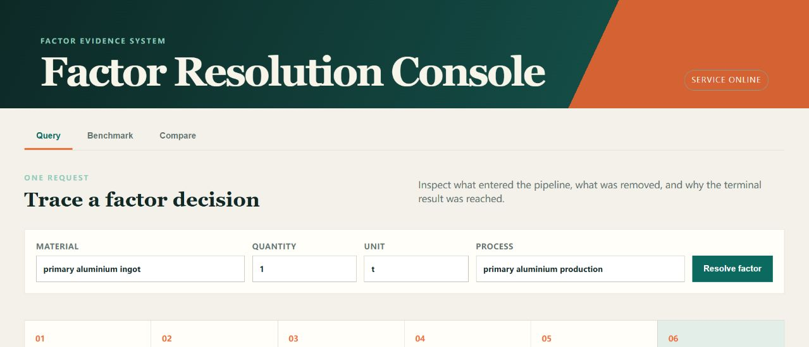
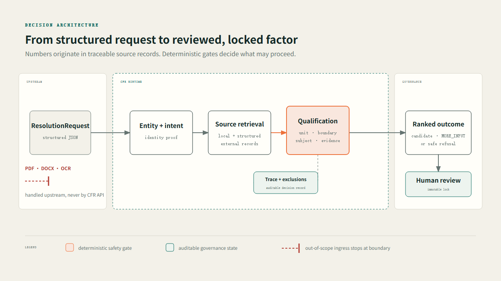
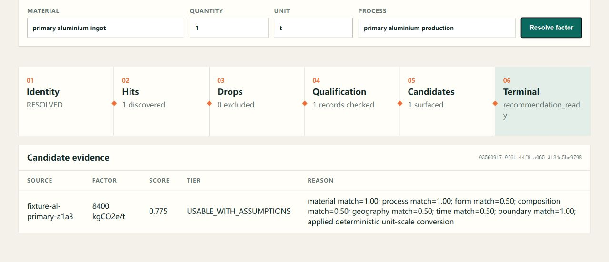

# CarbonFactorResolver

[](https://github.com/kamjcx/CarbonFactorResolver/actions/workflows/ci.yml)
[](https://github.com/kamjcx/CarbonFactorResolver/releases/latest)
[](pyproject.toml)
[](LICENSE)

**Evidence-governed carbon-factor retrieval and qualification for materials, energy,
transport, and processes.** CFR turns a structured factor request into an explainable
candidate, a precise `MORE_INPUT` question, or a safe refusal. Numeric values always come
from traceable source records; deterministic gates enforce unit, lifecycle-boundary,
subject, and provenance compatibility before human review and immutable locking.

The default HTTP application is a production-safe, fail-closed data plane: it does not load demo
fixtures or claim readiness without an explicitly injected engine/catalog. Benchmark execution, debug
resolution, full traces, and full diagnostics are absent. Deployments that need those operations
must bind the explicit admin/dev application to a separate protected port and inject their own
actor/tenant/project authorization policy. Live structured-source adapters are HTTPS-only,
same-origin by default, and bounded against SSRF, redirect, credential-forwarding, timeout, and
oversized-response attacks. See [the v4 threat model](docs/CFR_CONNECTOR_CONTROL_PLANE_SECURITY_V4.md).
Generic CFR does not ship a customer-specific catalog-priority policy. A deployment that injects
one must bind it to the exact catalog content; production-approval authority additionally requires
a deployment-verified signature. See [Engineering Delivery Hardening V6](docs/CFR_ENGINEERING_DELIVERY_HARDENING_V6.md).

> **Status:** portfolio-ready, reproducible research prototype. Bundled evaluations use
> public-synthetic fixtures. Results are not a claim of universal real-world accuracy or
> production carbon-accounting readiness.

The repository's pinned builds, scans, SBOM, and checksums are delivery evidence, not a production
security certification. Multi-instance idempotency/persistence, trust-root management, IAM,
monitoring, recovery, and formal factor-data approval remain deployment responsibilities.



## Why this exists

Semantic similarity alone can return a plausible but invalid factor: a finished product for
a raw material, A1-A3 total for an A2 request, ordinary graphite for a graphite electrode,
or a mass factor for an energy activity. CFR separates recall from admission:

1. resolve the material or activity entity and its modifiers;
2. retrieve local and hash-pinned structured external records;
3. reject incompatible units, boundaries, subjects, processes, and evidence;
4. rank only qualified candidates and explain every inclusion and exclusion;
5. require a human decision before an immutable factor is locked.



The diagram makes the critical separation explicit: retrieval may be broad, but only
deterministically qualified candidates reach ranking and review. Exclusions remain visible
with reason codes in Trace. Editable sources: [HTML](docs/assets/cfr-resolution-architecture.html)
and [SVG](docs/assets/cfr-resolution-architecture.svg).

## Five-minute quickstart

The Compose quickstart explicitly selects demo mode and uses small project-authored synthetic
fixtures. The image's default production command does not load them. Neither mode downloads or ships
ecoinvent, customer records, or any commercial factor database.

```bash
git clone https://github.com/kamjcx/CarbonFactorResolver.git
cd CarbonFactorResolver
docker compose up --build -d
curl http://127.0.0.1:8000/healthz
curl http://127.0.0.1:8000/readyz
```

Open `http://127.0.0.1:8000`, or submit a JSON request:

```bash
curl -X POST http://127.0.0.1:8000/api/v1/resolve \
  -H "Content-Type: application/json" \
  -d '{
    "material_name": "primary aluminium ingot",
    "quantity": 1,
    "quantity_unit": "t",
    "production_process": "primary aluminium production"
  }'
```

Python/CLI development setup:

```bash
pip install -e ".[test,api]"
cfr resolve --demo --material "aluminium" --quantity 1 --unit t
cfr benchmark run data/benchmarks/factorbench_v3.jsonl
cfr serve --demo --host 127.0.0.1 --port 8000
```

`/healthz` is liveness only. `/readyz` returns `503 SERVICE_NOT_READY` when an explicitly
configured engine or another required dependency is unavailable; optional external connectors
degrade readiness without taking the service down. CLI exit codes are `0` (direct/reviewable
result), `2` (invalid request), `10` (`MORE_INPUT`), `11` (unresolved), and `70` (internal failure).
See the [versioned API and operability contract](docs/CFR_VERSIONED_API_OPERABILITY_V5.md).

To connect your own licensed or internal structured catalogue, follow the
[Bring Your Own Catalog tutorial](docs/BRING_YOUR_OWN_CATALOG.md). It includes a 20-record
project-authored `PUBLIC_SYNTHETIC` fixture and three copyable exact-match,
`MORE_INPUT_NEEDED`, and safe-refusal queries. Imported records remain candidates until a
human reviews and locks a factor; the tutorial does not authorize accounting use.

## Three demo decisions

| Request | Expected behavior | Safety property |
|---|---|---|
| `primary aluminium ingot` + primary-production process | returns the traceable primary-aluminium candidate | exact entity/process qualification |
| `metallic aluminium feedstock` without a route | returns `MORE_INPUT_NEEDED` | does not choose primary vs. secondary production |
| unknown material or cross-dimension unit | returns a safe refusal with reason codes | never invents a numeric factor |

The Dashboard exposes the pipeline, terminal state, candidate evidence, score, result tier,
and decision reasons rather than presenting an unexplained search result.



See the [90-second demo script](docs/DEMO_SCRIPT_90S.md) for a concise interview walkthrough.

## Autonomous contract evaluation

The developer-only evaluator generates 414 non-duplicate public-synthetic resolution cases
from an independent, versioned Oracle, plus four API fault cases (418 total results). It
exercises exact boundary and subject matrices, unit
dimensions, evidence degradation, source priority, ambiguity, high-risk neighbouring
entities, deterministic replay, catalog perturbation, and approval/lock attacks against the
real Resolver. A separate scale harness measures 10k/50k synthetic catalogs at concurrency
10/25/50. Neither harness changes or approves a factor, and neither contains licensed or
customer data.

```bash
python -m tools.autonomous_evaluation --output outputs/autonomous-evaluation.json
python -m tools.autonomous_evaluation.performance --sizes 10000,50000 --concurrency 10,25,50
```

Generated expectations come from explicit contracts rather than from Resolver output. First
runs, failures, Bad Case attribution and artifact hashes are retained; a failed gate is a
diagnostic result, not tuned away. See the
[autonomous evaluation specification](docs/CFR_AUTONOMOUS_EVALUATION_V1.md).

## Architecture and product boundary

```text
Document Intelligence / carbon-report
             |
             | structured ResolutionRequest
             v
     CarbonFactorResolver
             |
             | reviewed / locked factor
             v
carbon-report calculation and report generation
```

**In scope**

- structured `FactorQuery` / `ResolutionRequest` input;
- multilingual entity resolution and controlled aliases;
- local and structured external factor-source retrieval;
- deterministic qualification, ranking, explanation, and Trace;
- human review support and immutable factor locking.

**Out of scope**

- PDF, DOCX, Excel, image parsing, or OCR;
- BOM, procurement-ledger, or enterprise activity-data extraction;
- full product-carbon-footprint calculation and report generation;
- automatic writes to, or approval in, a formal factor catalogue.

The document-capable tool under `tools/true_data_acceptance.py` is a developer-only offline
QA harness. It is not imported by the runtime or exposed through the CFR API.

## Reproducible evaluation

| Evidence set | Result | What it proves |
|---|---:|---|
| v0.14.1 core package (historical) | 324 passed, 87.06% branch coverage | prior stable-release gate |
| PR3 stacked candidate | 411 passed, 86.42% branch coverage | current Catalog-to-lock integrity regression gate |
| PR4 stacked candidate | 438 passed, 86.82% branch coverage | Python 3.11/3.12/3.13 connector and control-plane security regression gate |
| PR5 stacked candidate | 464 passed, 87.01% branch coverage | versioned API, fail-closed readiness, idempotency and scriptable CLI contract gate |
| PR6 stacked candidate | 483 passed, 87.00% branch coverage | generic policy boundary, full-package typing, graph invariants and supply-chain evidence gate |
| FactorBench V3 | 57 cases, contract metrics passed | versioned resolver behavior |
| Frozen Unit Regression | first run 24/28; post-fix 28/28 | unit-system regression, not an independent holdout |
| Closed Portfolio Benchmark | 39 direct + 1 `MORE_INPUT` with correct `REFERENCE_ONLY`; 0 boundary/subject violations | public-synthetic comparison and safety diagnostic |
| Portfolio Challenge V1 raw / V2 effective | raw 58/60 decisions and 14/54 legacy wrong/unlisted; effective 60/60, 12/12 `MORE_INPUT`, 8/8 option contracts, 0 formal escapes | immutable V1 evidence plus SHA-bound selectable-vs-reference adjudication |
| Sealed Unit Holdout v4 | independent first run 21/21; all checks 100% | post-fix unit-only acceptance |
| RC6 sealed first run | 48/48 full contracts; 0 safety escapes or HTTP 500 | frozen public-synthetic release gate |
| Autonomous Evaluation V1 / Safety V2 | 414 generated resolution contracts + 4 API fault cases; 103 raw bad, 13 adjudicated, 90 unresolved; 0 safety escapes | systematic contract exploration; the effective gate remains closed while unresolved cases remain |

RC3-RC5 and sealed unit v2/v3 remain preserved NO-GO evidence. `v0.14.1` added the
conditioned-volume direction repair, FIN-05 reference-only adjudication, and the independent
sealed unit v4 acceptance. `v0.14.2` contains the subsequently merged contract-backed runtime
repairs, public BYOC example, and release presentation evidence. See [Evaluation](EVALUATION.md),
[v0.14.2 Release Readiness](docs/RELEASE_READINESS_V0.14.2.md), and the
[v0.14.2 release](https://github.com/kamjcx/CarbonFactorResolver/releases/tag/v0.14.2).

## Design guarantees

- No language model or fallback code may originate an emission-factor value.
- Exact A1/A2/A3/A1-A3 and factor-subject matrices fail closed.
- Unsupported or cross-dimension units return stable reason codes.
- Source locator, content hash, declared product, boundary, and database anchors stay in Trace.
- Catalog content, candidate, recommendation revision, approval, reviewer and locked evidence are
  content-addressed; lock uses compare-and-set and freezes a separate evidence snapshot.
- Rejected candidates cannot later be approved in the same immutable resolution run.
- `REFERENCE_ONLY` results require an explicit, reasoned human override.

## Documentation

- [Architecture](ARCHITECTURE.md)
- [Evaluation methodology and results](EVALUATION.md)
- [Limitations](LIMITATIONS.md)
- [Data licensing](DATA_LICENSE.md)
- [Security policy](SECURITY.md)
- [Contributing](CONTRIBUTING.md)
- [Bring Your Own Catalog](docs/BRING_YOUR_OWN_CATALOG.md)
- [Catalog-to-lock integrity contract](docs/CFR_CATALOG_LOCK_INTEGRITY_V3.md)
- [Release notes](docs/RELEASE_NOTES_V0.14.2.md)
- [Technical implementation reference](docs/CFR_TECHNICAL_DOCUMENT.md)

## Data and license

The software is available under the [MIT License](LICENSE). Code licensing does not grant
rights to third-party factor data. No ecoinvent database, licensed factor export, customer
document, credential, or formal production catalogue is included. Users must provide their
own authorized structured sources and comply with their data licences; see
[DATA_LICENSE.md](DATA_LICENSE.md).
