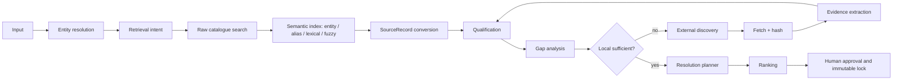

# CarbonFactorResolver architecture

CarbonFactorResolver keeps one domain graph. External discovery and diagnostics extend the existing registry, semantic index, qualification, gap-analysis, approval, and locking path; they do not create a second factor model.

Every numerical value enters through `SourceRecord` or versioned parameter evidence. Retrieval confidence, qualification, suitability, evidence completeness, and final rank remain separate fields.
