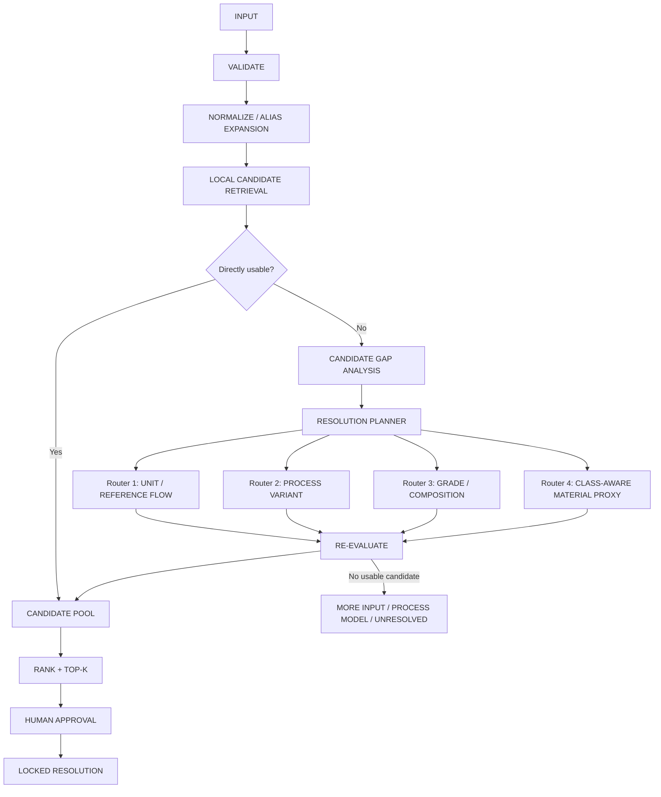

# OFR Proxy Resolution V1 技术更新

> 文档对象：A1 Factor Resolution Engine（OFR）的 Proxy Resolution 子系统  
> 文档状态：目标设计与实现规范，不代表当前代码已全部实现  
> 历史设计基线版本（不是当前实现版本）：OFR `0.1.0`  
> 设计版本：`proxy-resolution-v1.0`  
> 技术基线：Python 3.11+  
> 文档日期：2026-08-19  
> 核心目标：优先解决因子不完全匹配问题，减少不必要的安全门禁，在保留来源、公式、假设和人工审批的前提下，尽可能返回可采用的候选值。

---

## 1. 更新背景

现有 OFR 已经具备：

- 活动标准化；
- 本地正式因子目录检索；
- exact / 显式 alias 检索；
- Material Class 识别；
- class-aware Proxy 宽召回；
- 多维评分、Evidence Coverage、Top-K、Trace、人工审批和锁定。

但当前 Proxy Resolution 主要仍是：

```text
没有直接因子
→ 识别材料类别
→ 从同类材料中宽召回
→ 多维评分
→ Top-K
```

它能够回答“哪个候选更像”，但还不能系统回答真实核算中更常见的四类问题：

1. 因子存在，但活动量或功能单位不同；
2. 材料相同，但生产工艺不同；
3. 材料和工艺基本相同，但纯度、牌号或组成不同；
4. 目标材料完全不存在，只能采用其他材料或通用过程做代理。

因此，本次更新不再把 Proxy 简化为一个 `class_aware_proxy_link`，而是引入：

> **Candidate Gap Analysis + Resolution Planner + 四个 Resolution Router**

系统先识别“现有候选为什么不能直接采用”，再选择对应的解决方法。

---

## 2. 核心设计原则

### 2.1 Solve-first，而不是 Gate-first

系统的默认行为应当是：

```text
先尝试换算、修正、重构或做代理
→ 返回可解释的 Top-K
→ 由人工选择
```

而不是：

```text
字段不完整
→ 分数不足
→ 立即阻断
```

缺失信息应体现为：

- Evidence Gap；
- Assumption；
- Limitation；
- 较低的 Resolution Strength；
- 多个情景值或候选值。

只有在数学上无法计算、来源无法追溯或存在明确重复计算风险时，才进入硬阻断。

### 2.2 Retrieval 与 Resolution 分开

- **Retrieval**：从现有因子库中召回可能相关的来源记录；
- **Gap Analysis**：判断目标与候选之间差在哪里；
- **Resolution**：通过单位换算、过程调整、牌号调整或材料代理来解决差异；
- **Ranking**：比较多个已解析候选；
- **Approval**：人工决定正式采用哪个候选。

### 2.3 Synonym 不是 Proxy

Synonym 指同一材料的显式别名，例如：

```text
白刚玉 = white fused alumina = WFA
红柱石 = andalusite
```

下列关系不是 synonym：

```text
烧结镁砂 ≠ 电熔镁砂
90% 镁砂 ≠ 95% 镁砂
红柱石 ≠ 高岭土
```

因此，synonym 应主要作为 Normalize / Index 层的显式 alias 扩展，不再承担复杂业务路由职责。

### 2.4 数值来源与派生数值分开

原始因子值仍只能来自可追溯的 `SourceRecord`。

但 Process Router、Grade Router 等需要产生确定性派生值，因此新增：

```text
DerivedFactorCandidate
```

派生值必须满足：

```text
Derived value
= SourceRecord value(s)
+ ParameterEvidence value(s)
+ versioned deterministic formula
```

LLM 不得直接生成因子值、能耗、纯度差修正比例或转换参数。

---

## 3. 目标 Graph



四个 Router 不是严格互斥关系。一个请求可能同时存在多个 Gap，需要 Resolution Planner 按依赖顺序组合执行。

例如：

```text
目标：95% 烧结镁砂，活动量单位为“块”
候选：90% 电熔镁砂，因子单位 kgCO2e/kg

Gap：
1. Reference Flow Gap
2. Process Gap
3. Grade Gap

Plan：
Reference Flow Router
→ Process Variant Router
→ Grade Router
→ Re-evaluate
```

---

## 4. Candidate Gap Analysis

### 4.1 GapType

```text
UNIT_SCALE_GAP
REFERENCE_FLOW_GAP
PROCESS_VARIANT_GAP
GRADE_COMPOSITION_GAP
MATERIAL_ABSENT_GAP
BOUNDARY_GAP
GEOGRAPHY_GAP
TEMPORAL_GAP
FORM_GAP
```

其中前五项决定主要 Resolution Router；后四项通常作为调整参数、排序特征或限制说明，不单独形成大量 Graph Node。

### 4.2 Gap 识别原则

系统不应只根据总分判断候选是否不足，而应输出结构化差异：

```json
{
  "target": "95% sintered magnesia",
  "candidate": "90% fused magnesia",
  "gaps": [
    {
      "type": "PROCESS_VARIANT_GAP",
      "target": "sintered",
      "candidate": "fused"
    },
    {
      "type": "GRADE_COMPOSITION_GAP",
      "target": "95% MgO",
      "candidate": "90% MgO"
    }
  ]
}
```

### 4.3 Gap 与旧硬门槛的关系

现有规则中的下列情况不再直接 Reject：

- process mismatch；
- composition mismatch；
- product form mismatch；
- material class mismatch；
- 部分技术字段缺失。

它们应优先转化为 Gap，并进入相应 Router。

---

## 5. Router 1：Unit / Reference Flow Resolution

### 5.1 适用问题

#### A. 纯单位比例换算

例如：

```text
kgCO2e/t ↔ kgCO2e/kg
g ↔ kg ↔ t
```

这不是 Proxy，直接由确定性 Unit Engine 计算。

#### B. 不同功能单位或 Reference Flow

例如：

```text
目标活动量：100 块耐火砖
数据库因子：kgCO2e/kg
```

此时不能直接把“块”视为质量单位，必须找到：

```text
mass_per_piece
```

可接受的证据来源按优先级排序：

1. 企业实测单件净重；
2. BOM 或产品规格书中的单件重量；
3. 尺寸、净体积和体积密度推导；
4. 内部已审核产品规格目录；
5. 人工导入的供应商或行业参考记录。

本 V1 不恢复自动 External Retrieval 图节点。未来外部资料可以先转化为 `ReferenceFlowRecord` 后进入同一 Router，但 Router 本身不负责自由联网搜索。

### 5.2 多值处理

若存在多个合理的单件重量记录，不静默平均或选择一个，而是生成多个候选：

```text
Candidate A：4.1 kg/块，来源：企业实测
Candidate B：4.3 kg/块，来源：规格书
Candidate C：4.0 kg/块，来源：尺寸×密度推导
```

每个候选分别计算排放并保留来源和差异说明。

### 5.3 公式

```text
mass = piece_count × mass_per_piece
emission = mass × factor_per_mass
```

若通过尺寸和密度计算：

```text
mass_per_piece = net_volume × bulk_density
```

### 5.4 最小阻断条件

只有在下列情况下不得生成数值：

- 目标和因子维度不兼容；
- Piece-to-mass 转换没有任何质量、尺寸或密度依据；
- 转换参数为零、负数或非有限值。

此时返回：

```text
MORE_INPUT_NEEDED
required_field = mass_per_piece OR dimensions+density
```

这不是安全评分阻断，而是数学上缺少必要变量。

---

## 6. Router 2：Process Variant Resolution

### 6.1 适用问题

目标材料和候选材料基本相同，但生产过程不同，例如：

```text
烧结莫来石 ↔ 电熔莫来石
烧结镁砂 ↔ 电熔镁砂
煅烧氧化铝 ↔ 电熔氧化铝
天然矿物破碎料 ↔ 深度选矿精矿
```

此时不应把候选直接 Reject，也不能简单按总能耗比例缩放整个因子。

### 6.2 核心方法：共同上游 + 过程替换

当参考因子可以拆分时：

```text
Reference Factor
= Common Upstream
+ Reference Process Energy
+ Reference Other Process Contributions
```

先反推共同上游：

```text
Common Upstream
= EF_reference
- Σ(reference_activity_i × EF_i)
```

再加入目标过程：

```text
EF_target
= Common Upstream
+ Σ(target_activity_j × EF_j)
+ Δother
```

一般表达式：

```text
EF_target
= EF_reference
- EF_removed_reference_process
+ EF_added_target_process
+ Δother
```

其中所有活动数据和能源因子都必须来自 `ParameterEvidence` 或 `SourceRecord`。

### 6.3 三种计算模式

#### Mode A：DECOMPOSE_AND_REBUILD

能够识别参考过程的可替换组成，并拥有目标过程活动数据，执行完整替换计算。

#### Mode B：DELTA_ADJUST

只能可靠拆出部分过程差异时，仅调整有证据支持的部分，未调整部分明确保留共同假设。

#### Mode C：UNADJUSTED_PROCESS_PROXY

无法拆解参考总因子时，不创造修正数值，保留原因子作为工艺代理候选，并明确：

```text
same material
different production route
no supported process decomposition
```

自 `0.12.0` 起，Mode C 仍不进入可审批的 Recommendation Top-K，也不能通过 Reference Override 审批或锁定；但通过独立的 `diagnostic_candidates`、`missing_gaps` 和 `questions` 合同向界面返回来源值、Gap、排除原因和最小补充问题。Trace/exclusions 保留完整审计记录。

自 `0.12.1` 起，软治理限制但不存在技术硬阻断的 `REFERENCE_ONLY` 候选进入独立 `reviewable_candidates`，并携带 `reviewable_candidate_reasons`。它不占用普通 Top-K、不能普通审批，但可在有理由的 `reference_override` 治理流程中处理；技术硬阻断候选继续只进入 `diagnostic_candidates`。

自 `0.12.2` 起，仅有 `reviewable_candidates` 的路径明确终止为 `REFERENCE_REVIEW_REQUIRED`，不再写入错误的 `UNRESOLVED` LinkAttempt。过程会计 Assignment 同时披露 `quantification_status` 与 `missing_inputs`：识别到电极/焦炭并不代表其购入 A1 已量化，现场 A3 也只能由受控工艺上下文和可计算证据触发。

### 6.4 技术案例：烧结莫来石推导电熔莫来石

现有技术核算备忘录提供了一个可直接作为 Process Router 验收用例的实例。

#### 参考因子

```text
烧结莫来石：3.431355 tCO2e/t
```

#### 烧结过程参数

```text
综合能耗：365 kgce/t
电力占比：76%
天然气占比：24%
```

#### 电熔过程参数

```text
综合能耗：165 kgce/t
能源结构：100% 电力
```

#### 能源因子

```text
电力折标煤系数：0.1229 kgce/kWh
天然气折标煤系数：1.2143 kgce/Nm3
电力碳足迹因子：0.5777 kgCO2e/kWh
天然气完整因子：
2.162189 + 0.63048201256643
= 2.792671012566 kgCO2e/Nm3
```

#### 参考过程能源拆分

```text
烧结电力排放：1.303937998 tCO2e/t
烧结天然气排放：0.201464202 tCO2e/t
烧结能源合计：1.505402201 tCO2e/t
```

#### 共同原料上游

```text
3.431355 - 1.505402201
= 1.925952799 tCO2e/t
```

#### 电熔过程能源

```text
电熔用电量：165 / 0.1229
= 1342.554923 kWh/t

电熔电力排放：
1342.554923 × 0.5777 / 1000
= 0.775593979 tCO2e/t
```

#### 派生结果

```text
EF_electrofused_mullite
= 1.925952799 + 0.775593979
= 2.701546778 tCO2e/t
```

推荐展示值：

```text
2.701547 tCO2e/t
= 2.701547 kgCO2e/kg
```

### 6.5 本案例需要记录的假设

```text
ASSUMPTION_1：两种工艺的共同原料上游可视为相同
ASSUMPTION_2：原料损耗和成品率可视为相同
ASSUMPTION_3：参考因子确实包含被扣除的烧结生产能源
ASSUMPTION_4：目标过程能源边界与参考因子边界兼容
ASSUMPTION_5：本代理中 m3 与 Nm3 按同一数量口径使用
```

这些假设用于说明和排序，不因存在假设而自动阻断。

### 6.6 防止错误的必要约束

Process Router 只保留少量真正必要的硬约束：

1. 不得从参考因子中扣除一个未被该因子包含的过程；
2. 不得把已经包含生产环节的代理因子再次当作“纯原料上游”叠加；
3. 计算结果不得为负数或非有限值；
4. 被替换与新增的过程边界必须可以解释；
5. 参数必须具有来源记录。

其余问题，例如地域不同、年份不同、能源结构为工程估算，应记录为 limitation，而不是一律拒绝。

---

## 7. Router 3：Grade / Composition Resolution

### 7.1 适用问题

目标与候选属于同一材料或同一产品系列，但存在：

```text
纯度差异
牌号差异
主成分比例差异
再生料比例差异
含水率差异
浓度差异
```

例如：

```text
90% MgO 镁砂
95% MgO 镁砂
97% MgO 镁砂
```

### 7.2 禁止简单按纯度比例缩放总因子

不应使用：

```text
EF_95 = EF_90 × 95 / 90
```

因为纯度提高可能来自：

- 更高品位原料；
- 更强选矿；
- 更高煅烧温度；
- 更低收率；
- 更多燃料或电力；
- 不同添加剂与废料比例。

### 7.3 三层解析方法

#### Level A：同系列插值

当存在同一来源、同一边界、同一工艺系列的多个牌号时，可在已知范围内进行确定性插值。

```text
90% → EF_90
97% → EF_97
目标 95%
→ bounded interpolation
```

插值必须记录两个锚点 Source ID 和公式。

#### Level B：组成 / 工艺参数调整

若拥有明确的配方、良率、能源或加工差异，可按过程模型调整：

```text
EF_target
= Σ(component_fraction_i × EF_component_i)
+ process_energy
+ direct_emission
```

该模式本质上是轻量参数化 foreground model，应由确定性计算器执行。

#### Level C：Nearest-grade Proxy

只有一个近似牌号、且缺少调整依据时：

- 保留原因子值；
- 标记为 `GRADE_PROXY`；
- 记录目标与候选的成分差；
- 降低适用性和 Resolution Strength；
- 允许进入 Top-K；
- 不伪造一个修正后精确值。

### 7.4 多候选策略

例如目标为 95% 镁砂，可同时返回：

```text
Candidate A：97% 同工艺，Nearest-grade Proxy
Candidate B：90% 同工艺，Nearest-grade Proxy
Candidate C：由 90% 和 97% 同系列因子插值得到
```

若 C 的两个锚点证据一致，通常优先于单一 Nearest-grade Proxy。

---

## 8. Router 4：Class-aware Material Proxy Resolution

### 8.1 进入条件

只有在下列情况出现时进入：

- 没有目标材料的直接因子；
- 没有合理的同材料工艺变体可调整；
- 没有同材料牌号或组成变体可采用；
- 目标材料在当前数据库中实质缺失。

### 8.2 典型问题

```text
红柱石无直接因子
→ 是否可采用蓝晶石、硅线石、高岭土或通用非金属矿物开采因子？
```

高岭土只能作为候选之一，不能预设为天然正确答案。

### 8.3 材料类别

至少支持：

```text
NATURAL_MINERAL
MANUFACTURED_MINERAL
SYNTHETIC_CHEMICAL
METAL
RECYCLED_MATERIAL
BYPRODUCT
ENERGY_CARRIER
UNKNOWN
```

### 8.4 类别化召回与排序

#### NATURAL_MINERAL

优先比较：

1. 开采方式；
2. 选矿 / 破碎 / 筛分 / 干燥强度；
3. 是否天然矿物或人工合成；
4. 产品形态；
5. 地域；
6. 化学组成；
7. 时间。

#### MANUFACTURED_MINERAL

优先比较：

1. 电熔 / 烧结 / 煅烧等工艺路线；
2. 原料路线；
3. 能源强度；
4. 产品形态；
5. 成分和纯度；
6. 地域和时间。

#### SYNTHETIC_CHEMICAL

优先比较：

1. 化学身份；
2. 反应路线；
3. 原料；
4. 浓度和纯度；
5. 技术、地域和时间。

### 8.5 结果输出

返回 Top-K，而不是唯一代理：

```text
#1 Technical Proxy
材料：候选 A
因子：...
理由：生产路线最相近
限制：组成和地域不同

#2 Class Proxy
材料：候选 B
因子：...
理由：同为天然铝硅酸盐矿物
限制：选矿强度未知

#3 Generic Proxy
材料：通用非金属矿物开采
因子：...
理由：工艺类别一致
限制：产品特异性低
```

---

## 9. Resolution Planner

### 9.1 默认优先顺序

```text
1. Direct Match
2. Unit Scale Conversion
3. Reference Flow Conversion
4. Process Variant Resolution
5. Grade / Composition Resolution
6. Class-aware Material Proxy
7. More Input / Process Model / Unresolved
```

### 9.2 为什么按这个顺序

- 单位换算不会改变材料或工艺含义；
- Reference Flow 解决活动量表达差异；
- Process Router 尽量保留同一材料身份；
- Grade Router 仍在同一材料族内解决；
- Class-aware Proxy 是最后一级材料替代。

### 9.3 多 Router 组合

Planner 输出结构化步骤：

```json
{
  "plan_id": "plan-001",
  "gaps": [
    "REFERENCE_FLOW_GAP",
    "PROCESS_VARIANT_GAP",
    "GRADE_COMPOSITION_GAP"
  ],
  "steps": [
    "REFERENCE_FLOW_CONVERSION",
    "PROCESS_DELTA_ADJUSTMENT",
    "GRADE_INTERPOLATION"
  ]
}
```

每一步都必须保存输入、输出和依赖关系，避免只在 Trace 中写自然语言结论。

---

## 10. 新领域模型

### 10.1 ParameterEvidence

用于记录派生计算参数：

```text
parameter_id
name
value
unit
source_type
provider
locator
citation
observed_at
quality_note
```

来源可以包括：

```text
internal_measurement
user_confirmed_engineering_data
supplier_specification
formal_standard
internal_catalog
literature_import
```

### 10.2 ResolutionGap

```text
gap_id
gap_type
target_value
candidate_value
severity
reason
resolvable_by
```

### 10.3 TransformationStep

```text
step_id
router_type
method
input_source_ids
parameter_ids
formula_id
formula_expression
input_values
output_value
output_unit
assumptions
warnings
```

### 10.4 DerivedFactorCandidate

```text
candidate_id
resolution_type
base_source_ids
parameter_evidence_ids
transformation_steps
factor_value
factor_unit
boundary
geography
year
reasons
limitations
evidence_coverage
resolution_strength
provenance_lineage
```

### 10.5 ResolutionType

```text
DIRECT_EXACT
DIRECT_ALIAS
UNIT_CONVERTED
REFERENCE_FLOW_CONVERTED
PROCESS_ADJUSTED
UNADJUSTED_PROCESS_PROXY
GRADE_INTERPOLATED
GRADE_ADJUSTED
GRADE_PROXY
CLASS_TECHNICAL_PROXY
CLASS_GENERIC_PROXY
```

---

## 11. Ranking：以可用性为目标，不用单一阈值阻断

### 11.1 类型优先级

默认优先级：

```text
DIRECT_EXACT
> DIRECT_ALIAS
> UNIT / REFERENCE FLOW CONVERTED
> PROCESS_ADJUSTED
> GRADE_INTERPOLATED / GRADE_ADJUSTED
> GRADE_PROXY
> CLASS_TECHNICAL_PROXY
> CLASS_GENERIC_PROXY
```

### 11.2 同类型内排序

```text
适用性得分
→ Evidence Coverage
→ 来源类型
→ 假设数量与影响
→ 稳定 Source ID
```

### 11.3 不再使用统一 min_score 决定“有没有结果”

建议将候选划分为：

```text
PRIMARY_RECOMMENDATION
USABLE_WITH_ASSUMPTIONS
REFERENCE_ONLY
```

- `PRIMARY_RECOMMENDATION`：适合提交审批；
- `USABLE_WITH_ASSUMPTIONS`：可以用于当前核算，但必须披露假设；
- `REFERENCE_ONLY`：仅供审核人员比较，不建议直接锁定。

这样可以保留有业务价值的候选，同时避免把低证据候选伪装成高质量结果。

### 11.4 Resolution Strength

现有 Confidence 更适合改名为：

```text
resolution_strength
```

它不是统计概率，不表示“80% 正确”。

可以综合：

- 适用性；
- Evidence Coverage；
- 来源质量；
- 派生步骤数量；
- 假设影响；
- Top-2 分差。

该值用于排序和展示，不自动触发批准或拒绝。

---

## 12. 最小硬约束

为了避免再次工程过量，V1 只保留以下硬约束：

### 12.1 数值来源约束

任何原始数值必须来自 `SourceRecord` 或 `ParameterEvidence`；LLM 不能创造数值。

### 12.2 数学有效性约束

不得产生：

- 非有限值；
- 负排放因子；
- 零或负良率；
- 维度不兼容的单位运算。

### 12.3 重复计算约束

派生计算不得：

- 从不含某过程的因子中扣除该过程；
- 把已含生产环节的因子再次作为纯原料上游叠加；
- 同一能源或活动重复加入。

### 12.4 Provenance 约束

每个派生值必须能追溯：

```text
基础因子
→ 参数
→ 公式
→ 假设
→ 输出值
```

除此之外，地域差异、时间差异、证据不完整、工程估算和合理代理关系原则上作为限制条件和排序因素处理，不默认阻断。

---

## 13. Trace 要求

Trace 必须能回答：

1. 初始召回了哪些因子；
2. 候选与目标之间有哪些 Gap；
3. 为什么选择某个 Router；
4. 使用了哪些 SourceRecord 和 ParameterEvidence；
5. 执行了什么公式；
6. 哪些假设影响了结果；
7. 是否存在单位、过程、牌号或材料替代；
8. 为什么候选排名第一；
9. 人工最终采用或拒绝了什么。

电熔莫来石案例的 Trace 应类似：

```text
SINTERED_MULLITE exact material family candidate found
→ PROCESS_VARIANT_GAP: sintered vs fused
→ PROCESS_VARIANT_ROUTER selected
→ subtract sintering electricity
→ subtract sintering natural-gas direct + upstream
→ retain common upstream
→ add electrofused electricity
→ derived factor = 2.701546778 tCO2e/t
→ assumptions attached
→ awaiting human approval
```

---

## 14. 与现有 OFR 的代码变更建议

### 14.1 Graph

当前：

```text
local_evaluate
→ material_resolution
→ proxy_resolution
→ proxy_evaluate
```

更新为：

```text
local_evaluate
→ gap_analysis
→ resolution_planner
→ one-or-more resolution routers
→ re_evaluate
```

### 14.2 State

新增：

```text
gaps
resolution_plan
reference_flow_records
parameter_evidence
transformation_steps
derived_candidates
assumptions
warnings
```

### 14.3 Ports

建议新增：

```python
class ReferenceFlowRepositoryPort(Protocol):
    async def search(activity) -> Sequence[ReferenceFlowRecord]: ...

class ProcessParameterRepositoryPort(Protocol):
    async def search(target, reference) -> Sequence[ParameterEvidence]: ...

class GradeSeriesRepositoryPort(Protocol):
    async def search(material, process) -> Sequence[SourceRecord]: ...
```

现有 `ProxyRepositoryPort` 保留，专用于第四级 Class-aware Proxy。

### 14.4 计算器

新增确定性模块：

```text
unit_resolution.py
reference_flow_resolution.py
process_adjustment.py
grade_resolution.py
resolution_planner.py
derived_factor.py
```

公式需要 versioned Formula ID，例如：

```text
process.replace_energy_components/v1
grade.linear_interpolation_same_series/v1
reference_flow.mass_per_piece/v1
reference_flow.volume_density/v1
```

### 14.5 LLM 责任

LLM 可以：

- 识别材料别名；
- 判断目标和候选的工艺关系；
- 提取纯度、牌号和产品形态；
- 建议 GapType；
- 在限定候选中说明技术相似性。

LLM 不可以：

- 生成转换系数；
- 猜测单件重量；
- 猜测能耗；
- 按纯度比例自行调整因子；
- 修改基础因子；
- 自动批准派生值。

---

## 15. 验收案例

### Case 1：质量单位换算

```text
目标：10 t 原料
因子：kgCO2e/kg
预期：确定性换算并直接计算，不进入 Proxy。
```

### Case 2：件数转质量，有实测重量

```text
目标：100 块砖
单件实测：4.2 kg/块
因子：kgCO2e/kg
预期：转换为 420 kg，并保留单件重量来源。
```

### Case 3：件数转质量，有多个规格

```text
单件重量候选：4.0、4.2、4.3 kg/块
预期：生成多个候选或情景值，不静默平均。
```

### Case 4：件数转质量，无任何依据

```text
预期：MORE_INPUT_NEEDED，明确只缺 mass_per_piece 或 dimensions+density。
```

### Case 5：烧结莫来石 → 电熔莫来石

```text
预期：Process Router 计算结果
2.701546778 tCO2e/t
允许展示为 2.701547 tCO2e/t。
```

### Case 6：防止生产环节重复计算

```text
候选已包含高铝耐火材料生产环节
预期：不得把它作为纯原料上游再叠加目标生产能耗。
```

### Case 7：90% → 95% 镁砂，有同系列锚点

```text
预期：在同一来源、同一工艺系列内插值，保存两个锚点和公式。
```

### Case 8：90% → 95% 镁砂，只有一个候选

```text
预期：返回 GRADE_PROXY，保留原值并披露 5 个百分点纯度差，不按 95/90 线性缩放。
```

### Case 9：红柱石无直接因子

```text
预期：进入 Class-aware Proxy，返回 3 个技术上可解释的内部数据库候选；
高岭土可以进入候选，但不能被硬编码为唯一答案。
```

### Case 10：多 Gap 组合

```text
目标：按块记录的 95% 烧结镁砂
候选：按 kg 的 90% 电熔镁砂
预期：Reference Flow → Process → Grade 顺序执行，Trace 完整。
```

---

## 16. 明确不在本轮范围

- 自动开放互联网搜索；
- EPD / 文献自动抓取；
- 完整 Brightway foreground runtime；
- 任意化学反应自动建模；
- 自动批准和锁定；
- 基于 LLM 记忆生成因子；
- 为每种材料单独写大量硬编码分支。

未来 External Evidence Retrieval、Brightway 或供应商数据模块可以通过 `SourceRecord`、`ParameterEvidence` 和新 Ports 接入，不需要改变四 Router 的核心模型。

---

## 17. 上游工程思想与本项目差异

本设计继续借鉴：

- **Brightway2-io**：统一格式、顺序应用 linking strategies、显式保留未链接状态和中间结果；
- **FAULDIER**：非标准 LCI 数据 harmonization、单位和地域统一、缺失过程代理；
- **Amazon Carbon Assessment with ML**：在有界候选集中进行 EIF matching、ranking 和 Top-K；
- **lca_algebraic**：参数化 foreground exchange、确定性公式和快速重算的思想。

本项目新增的关键能力是：

```text
Candidate Gap Analysis
+ Four Resolution Routers
+ Multi-step Resolution Planner
+ Derived Factor Lineage
+ Solve-first Result Tiers
```

它不只判断“哪个候选更相似”，而是进一步回答：

> 候选与目标哪里不同，以及能否通过可追溯的工程方法把差异解决掉。

---

## 18. 实施优先级

### P0：Process Router

优先实现，因为已有电熔莫来石真实案例和确定性预期结果，可快速形成可验收 Vertical Slice。

### P1：Unit / Reference Flow Router

解决大量活动量单位和功能单位不一致问题，工程复杂度较低、业务收益高。

### P2：Grade / Composition Router

先实现同系列插值和 Nearest-grade Proxy，后续再加入组成和工艺参数模型。

### P3：Class-aware Material Proxy

在已有 Proxy Repository 基础上增强结构化工艺属性、类别化权重和 Top-K 说明。

---

## 19. V1 完成定义

Proxy Resolution V1 达成的标准不是“设置了更多门槛”，而是：

1. 能识别候选与目标之间的具体 Gap；
2. 能选择并执行对应 Router；
3. 能对可换算问题给出确定性结果；
4. 能对可调整工艺给出来源、公式和假设完整的派生值；
5. 能对纯度差异返回插值、调整或最近牌号候选；
6. 能对完全缺失材料返回技术合理的 Top-K Proxy；
7. 除数学无解、来源不可追溯和重复计算外，不因字段不完整而过早阻断；
8. 所有结果最终仍保留人工审批和锁定。

最终目标：

> **从“找不到完全相同因子就失败”，升级为“识别差异、选择解决策略、尽量给出有依据的候选结果”。**
