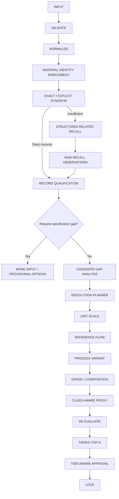

# OFR 钢纤维解析问题改进设计

> 系统：OFR / A1 Factor Resolution Engine  
> 当前基线：0.2.0  
> 文档日期：2026-08-20  
> 文档类型：架构改进与实施规格  
> 适用范围：钢纤维案例及同类“材料身份不完整、相关召回过宽、记录资格不明”的因子解析问题

## 1. 文档目标

本设计用于修复“钢纤维”正式目录实跑中暴露的结构性问题：

- 产品形态“纤维”被错误当作材料身份；
- Related Recall 召回了硅酸铝耐火纤维；
- Candidate Evaluation 被单位异常短路，只记录一个排除原因；
- 正式目录的 `emission_limit` 记录缺少资格隔离；
- 中文“钢纤维”被分类为 `UNKNOWN`；
- 系统不能区分“缺产品身份”和“缺供应商碳数据”；
- Class-aware Proxy 没有配置候选时过早进入 `supplier-data`；
- `REFERENCE_ONLY` 候选存在被普通审批和锁定的风险。

本次改进不通过继续调整总分阈值或增加大量硬门槛解决，而是明确四个边界：

```text
材料身份
≠ 产品形态

检索命中
≠ 合格因子记录

参考候选
≠ 可正式锁定候选

输入信息不足
≠ 供应商碳数据缺失
```

## 2. 当前实跑结论

“钢纤维”请求在正式目录中：

1. exact 无命中；
2. synonym 无命中；
3. related recall 返回6条硅酸铝耐火纤维排放限额；
4. 6条记录全部因 `kgCO2e/t产品` 单位格式不支持而排除；
5. Gap Analysis 和 Resolution Planner 因没有Candidate而为空；
6. Material Resolution 返回 `UNKNOWN`；
7. Class-aware Proxy 返回0条；
8. 最终进入 `supplier_data_required`。

最终有界停止是正确的，但状态语义不够准确：系统当前最先缺少的是钢纤维产品类型，而不是供应商碳数据。

## 3. 改进原则

### 3.1 Early identity enrichment，不提前做Proxy路由

Normalize阶段应尽早形成结构化`MaterialIdentity`，用于约束召回和识别输入缺口；当前`MaterialClass`仍保持晚绑定，只在Class-aware Proxy阶段使用。

```text
Early Material Identity
≠
Early Material Class Router
```

### 3.2 Strict Direct，Structured Related

- exact和explicit synonym保持严格；
- broader/narrower、grade、form和process关系不得混入synonym；
- Related Recall必须经过材料身份约束；
- form-only命中只能成为Raw Recall Observation，不能成为正式Candidate。

### 3.3 Qualification before calculation

目录记录必须先证明“它是一个适用类型的因子”，再进行单位换算、Gap Analysis和派生计算。

### 3.4 Solve-first但分层输出

系统可以返回有依据的参考候选，但必须区分：

- Primary Recommendation；
- Usable With Assumptions；
- Reference Only；
- Provisional Option；
- More Input Needed。

### 3.5 Trace保留原始召回事实

错误记录不必从Trace中消失。应记录“为什么看到了它”和“为什么没有让它进入候选池”。

## 4. 目标Graph



该Graph不恢复External Retrieval/Evaluate，也不增加无限重试。

## 5. 数据模型改进

### 5.1 MaterialIdentity

新增请求级材料身份结构，不替代晚绑定`MaterialClass`。

```python
@dataclass(frozen=True, slots=True)
class MaterialIdentity:
    canonical_name: str
    head_material: str | None = None
    material_family: str | None = None
    category: MaterialCategory = MaterialCategory.UNKNOWN
    product_form: str | None = None
    grade: str | None = None
    composition: str | None = None
    surface_coating: str | None = None
    manufacturing_route: tuple[str, ...] = ()
    application: str | None = None
    unresolved_attributes: tuple[str, ...] = ()
    rationale: str = ""
    confidence: float = 0.0
```

“钢纤维”建议结构：

```json
{
  "canonical_name": "steel fiber",
  "head_material": "steel",
  "material_family": "steel_products",
  "category": "METAL",
  "product_form": "fiber",
  "grade": null,
  "surface_coating": null,
  "manufacturing_route": [],
  "application": null,
  "unresolved_attributes": [
    "steel_fiber_type",
    "steel_grade_or_family",
    "surface_coating",
    "application"
  ]
}
```

“硅酸铝耐火纤维”建议结构：

```json
{
  "canonical_name": "aluminosilicate refractory fiber",
  "head_material": "aluminosilicate",
  "material_family": "aluminosilicate_refractory",
  "category": "MANUFACTURED_MINERAL",
  "product_form": "fiber"
}
```

两者共享`product_form=fiber`，但材料主体、family和category不同，因此不能进入同一正式候选池。

### 5.2 RequestGap

当前`ResolutionGap`要求`candidate_id`，不适合表达“请求本身信息不足”。新增请求级Gap：

```python
class RequestGapType(str, Enum):
    INPUT_SPECIFICATION = "INPUT_SPECIFICATION_GAP"
    MATERIAL_IDENTITY = "MATERIAL_IDENTITY_GAP"


@dataclass(frozen=True, slots=True)
class RequestGap:
    gap_id: str
    gap_type: RequestGapType
    field: str
    reason: str
    required: bool
    options: tuple[str, ...] = ()
    depends_on: str | None = None
```

RequestGap与Candidate ResolutionGap分开：

```text
RequestGap
→ 用户还没有描述清楚什么

ResolutionGap
→ 某条候选与目标之间差什么
```

### 5.3 FactorKind

`FactorSourceType`继续表达来源；新增`FactorKind`表达数值语义：

```python
class FactorKind(str, Enum):
    LIFECYCLE_FACTOR = "lifecycle_factor"
    EPD_INDICATOR = "epd_indicator"
    EMISSION_LIMIT = "emission_limit"
    COMBUSTION_FACTOR = "combustion_factor"
    ENERGY_FACTOR = "energy_factor"
    TRANSPORT_FACTOR = "transport_factor"
    STOICHIOMETRIC_FACTOR = "stoichiometric_factor"
    DERIVED_PROXY_FACTOR = "derived_proxy_factor"
    OTHER = "other"
```

`SourceRecord`增加：

```python
factor_kind: FactorKind
indicator: str | None
declared_product: str | None
boundary_modules: tuple[str, ...]
```

A1 Material Resolver默认可进入正式候选的FactorKind：

```text
LIFECYCLE_FACTOR
EPD_INDICATOR
DERIVED_PROXY_FACTOR
```

`EMISSION_LIMIT`默认只能作为Raw Recall Observation或参考信息，不能直接成为A1因子Candidate。

### 5.4 RecallObservation

新增原始召回观察对象：

```python
@dataclass(frozen=True, slots=True)
class RecallObservation:
    source_id: str
    material_name: str
    retrieval_strategy: LinkStrategy
    retrieval_basis: tuple[str, ...]
    identity_compatibility: str
    factor_kind: FactorKind
    eligible_for_candidate_pool: bool
    primary_exclusion: str | None = None
    additional_exclusions: tuple[str, ...] = ()
```

这让OFR可以同时表达：

```text
搜索看到了该记录
但它没有资格成为因子候选
```

### 5.5 CandidateQualification

```python
class QualificationStatus(str, Enum):
    PASS = "pass"
    MISMATCH = "mismatch"
    UNKNOWN = "unknown"
    NOT_EVALUATED = "not_evaluated"


@dataclass(frozen=True, slots=True)
class QualificationDimension:
    status: QualificationStatus
    reasons: tuple[str, ...] = ()


@dataclass(frozen=True, slots=True)
class CandidateQualification:
    source_id: str
    identity: QualificationDimension
    factor_kind: QualificationDimension
    indicator: QualificationDimension
    declared_product: QualificationDimension
    boundary: QualificationDimension
    unit: QualificationDimension
    eligible: bool
    primary_exclusion: str | None = None
    additional_exclusions: tuple[str, ...] = ()
```

## 6. Normalize和材料身份解析

### 6.1 职责

Normalize阶段应输出：

- canonical name；
- strict aliases；
- MaterialIdentity；
- 原始输入和标准化规则；
- unresolved attributes；
- 请求级Gap候选。

### 6.2 LLM边界

LLM可用于：

- 识别head material；
- 提取grade、coating、application和process；
- 判断术语是broader concept还是具体产品；
- 返回缺失属性。

LLM不得：

- 创建因子值；
- 创建目录中不存在的Source ID；
- 将broader concept自动登记为具体产品synonym；
- 把不确定属性当作已确认事实。

### 6.3 默认规则最低要求

无LLM时至少支持：

```text
钢 / 钢纤维 / 不锈钢 / 合金钢 → METAL
硅酸铝 / 陶瓷纤维 → MANUFACTURED_MINERAL
446 / S44600 → ferritic stainless steel grade
镀铜 → surface_coating=copper
未镀铜 → surface_coating=none
```

## 7. 严格概念关系

建议材料关系至少支持：

```text
SAME_AS
BROADER_THAN
NARROWER_THAN
GRADE_OF
FORM_OF
PROCESS_VARIANT_OF
CLASS_PROXY_OF
```

示例：

```text
WFA SAME_AS white fused alumina
镀铜钢纤维 NARROWER_THAN 钢纤维
AISI 446 GRADE_OF ferritic stainless steel
钢纤维 FORM_OF steel
电熔莫来石 PROCESS_VARIANT_OF mullite
```

只有`SAME_AS`可以进入synonym link。其他关系由Related Recall、Grade、Process或Proxy Resolver处理。

## 8. Structured Related Recall

### 8.1 召回条件

进入正式Related Candidate集合必须满足至少一个强条件：

```text
category compatible
或 material_family compatible
或 head_material equivalent/compatible
```

弱特征只能用于排序：

```text
product form
grade
composition
process
application
geography
time
```

### 8.2 禁止规则

```text
form-only match
→ 只能进入 raw_related_hits
→ 不得进入 Candidate Pool
```

钢纤维与硅酸铝纤维示例：

```text
METAL vs MANUFACTURED_MINERAL       incompatible
steel_products vs aluminosilicate  incompatible
steel vs aluminosilicate           incompatible
fiber vs fiber                     form-only

结果：Raw Recall可见，Candidate不合格
```

### 8.3 Trace结构

```json
{
  "source_id": "emission_limit:AL_SI_FIBER_NEEDLE",
  "retrieval_basis": [
    "product form token matched: fiber"
  ],
  "identity_compatibility": "mismatch",
  "eligible_for_candidate_pool": false,
  "primary_exclusion": "material_category_mismatch",
  "additional_exclusions": [
    "material_family_mismatch",
    "head_material_mismatch",
    "factor_kind_mismatch"
  ]
}
```

## 9. Record Qualification

### 9.1 执行顺序

```text
Material Identity
→ Factor Kind
→ Indicator
→ Declared Product
→ Boundary
→ Unit Syntax and Reference Product Qualifier
```

只有资格通过后才进入：

```text
Unit Conversion
→ Candidate Gap Analysis
→ Resolution Planner
```

### 9.2 多原因收集

评估不能遇到第一个错误后直接返回，但也不需要在identity已明确冲突时执行不必要的昂贵语义推理。

推荐输出：

```json
{
  "identity": {
    "status": "mismatch",
    "reasons": [
      "aluminosilicate refractory fiber is not steel fiber"
    ]
  },
  "factor_kind": {
    "status": "mismatch",
    "reasons": [
      "emission limit is not an A1 lifecycle factor"
    ]
  },
  "unit": {
    "status": "unknown",
    "reasons": [
      "product qualifier requires declared-product validation"
    ]
  },
  "process": {
    "status": "not_evaluated",
    "reasons": [
      "not evaluated because material identity failed"
    ]
  },
  "eligible": false,
  "primary_exclusion": "material_family_mismatch",
  "additional_exclusions": [
    "factor_kind_mismatch",
    "unit_qualifier_requires_validation"
  ]
}
```

## 10. 单位解析与Declared Product分离

`kgCO2e/t产品`应被解析为：

```json
{
  "numerator": "kgCO2e",
  "denominator_mass": "t",
  "reference_product_qualifier": "产品"
}
```

“产品”不是新的质量单位。但只有同时满足以下条件，才能转换为质量因子：

```text
FactorKind允许
Indicator是目标GWP指标
Declared Product与目标相容
Boundary可用
Denominator确实为产品质量
```

因此：

```text
unit parse success
≠
factor qualification success
```

硅酸铝纤维限额即使单位语法解析成功，也应因材料身份和FactorKind不适用而排除。

## 11. More Input设计

### 11.1 扩展现有状态

当前OFR已经具备：

```text
ResolutionStatus.MORE_INPUT_NEEDED
FollowUp.MORE_INPUT
```

本次不新增重复状态，而是扩展其适用范围：

```text
Reference Flow missing
+
Input Specification missing
+
Material Identity ambiguous
```

### 11.2 分层询问

第一问：

```json
{
  "field": "steel_fiber_type",
  "question": "请选择钢纤维类型",
  "options": [
    {
      "value": "ordinary_uncoated_carbon_steel",
      "label": "普通未镀铜碳钢纤维"
    },
    {
      "value": "copper_plated_steel",
      "label": "镀铜钢纤维"
    },
    {
      "value": "heat_resistant_stainless_steel",
      "label": "耐热不锈钢纤维"
    },
    {
      "value": "unknown",
      "label": "暂不确定"
    }
  ]
}
```

仅当选择耐热不锈钢时再问：

```text
grade: 446 / 310 / 304 / other / unknown
```

仅当需要过程调整时再问：

```text
manufacturing_route: drawing / cutting / melt extraction / shearing / other
```

### 11.3 Provisional Options

More Input响应可以返回不带正式选择语义的候选方向：

```json
{
  "status": "more_input_needed",
  "reason": "steel fiber is a broader product family",
  "required_choice": {
    "field": "steel_fiber_type"
  },
  "provisional_options": [
    {
      "option_type": "ordinary_uncoated_reference",
      "not_selected_because": "coating and steel family are unknown"
    },
    {
      "option_type": "copper_plated_reference",
      "not_selected_because": "surface coating is unknown"
    },
    {
      "option_type": "ferritic_stainless_reference",
      "not_selected_because": "steel grade is unknown"
    }
  ]
}
```

Provisional Option不是Candidate，不显示为已推荐因子，也不能进入审批和锁定。

## 12. 钢纤维数据闭环

### 12.1 普通未镀铜钢纤维

正式目录独立记录：

```text
code: STEEL_FIBER_UNCOATED_CN
product: Steel fiber, without copper plating
factor: 0.93 kgCO2e/kg
boundary: A1-A3
geography: China
reference year: 2025
factor_kind: EPD_INDICATOR
source: EPD-IES-0014210:002
```

来源：<https://www.environdec.com/library/epd14210>

### 12.2 镀铜钢纤维

```text
code: STEEL_FIBER_COPPER_PLATED_CN
product: Steel fiber, with copper plating
factor: 1.27 kgCO2e/kg
boundary: A1-A3
geography: China
factor_kind: EPD_INDICATOR
source: EPD-IES-0023901:002
```

来源：<https://www.environdec.com/library/epd23901>

### 12.3 Alias与概念关系

不得将宽泛“钢纤维”同时登记为上述两个产品的strict alias。

```text
未镀铜普通钢纤维 SAME_AS steel fiber without copper plating
镀铜钢纤维 SAME_AS steel fiber with copper plating

未镀铜普通钢纤维 NARROWER_THAN 钢纤维
镀铜钢纤维 NARROWER_THAN 钢纤维
耐热不锈钢纤维 NARROWER_THAN 钢纤维
```

### 12.4 446耐热钢纤维

目标身份：

```json
{
  "category": "METAL",
  "head_material": "steel",
  "material_family": "ferritic_stainless_steel",
  "grade": "AISI 446 / UNS S44600",
  "product_form": "fiber",
  "application": "high_temperature_refractory"
}
```

Resolution Plan：

```text
446钢纤维Direct
→ 若无：446/S44600钢材
→ 若无：高铬铁素体不锈钢
→ 若无：普通铁素体不锈钢family reference
→ Process Variant Resolution
→ 拉丝/切割/熔抽调整
```

普通铁素体不锈钢 EPD 只能是family-level reference，不能标记为446 exact factor。

## 13. Result Tier与审批边界

### 13.1 当前风险

当前`candidate_rejection_reasons()`不提供有效硬阻断，`approve()`和`lock()`也未检查`ResultTier`。因此`REFERENCE_ONLY`一旦进入`recommendation_ready`，可能被普通审批并锁定。

### 13.2 建议策略

```text
PRIMARY_RECOMMENDATION
→ 普通审批
→ 可锁定

USABLE_WITH_ASSUMPTIONS
→ 必须确认assumptions
→ 可锁定

REFERENCE_ONLY
→ 默认不可普通锁定
→ 需要显式override approval

PROVISIONAL_OPTION
→ 不属于Candidate
→ 不可审批/锁定
```

建议增加：

```python
class ApprovalMode(str, Enum):
    STANDARD = "standard"
    ASSUMPTION_ACCEPTANCE = "assumption_acceptance"
    REFERENCE_OVERRIDE = "reference_override"
```

审批校验：

```python
if candidate.result_tier == ResultTier.REFERENCE_ONLY:
    require approval.mode == ApprovalMode.REFERENCE_OVERRIDE
    require approval.note
```

锁定Trace必须记录：

- candidate result tier；
- approval mode；
- accepted assumptions；
- override reason；
- unresolved warnings。

## 14. Router与Planner调整

### 14.1 不新增独立计算Router

`INPUT_SPECIFICATION_GAP`属于Request Planner的交互结果，不是数值转换Router。

当前解析步骤仍保持：

```text
Unit Scale
→ Reference Flow
→ Process Variant
→ Grade/Composition
→ Class-aware Proxy
```

### 14.2 请求级规划

建议在Candidate Planner之前新增轻量请求规划：

```python
@dataclass(frozen=True, slots=True)
class RequestResolutionPlan:
    request_id: str
    gaps: tuple[RequestGap, ...]
    next_question: RequestGap | None
    provisional_options: tuple[ProvisionalOption, ...]
```

若存在高优先级`INPUT_SPECIFICATION_GAP`：

- 不执行数值派生；
- 返回More Input；
- 保留Raw Recall和Provisional Options；
- 用户补充后以新请求重新执行；
- 不在同一Graph内无限等待或循环。

## 15. Trace改进

新增或扩展以下Trace字段：

```json
{
  "material_identity": {},
  "request_gaps": [],
  "raw_related_hits": [],
  "record_qualifications": [],
  "candidate_gaps": [],
  "resolution_plans": [],
  "required_choice": null,
  "provisional_options": [],
  "approval_policy": {},
  "link_attempts": []
}
```

钢纤维误召回记录期望Trace：

```json
{
  "source_id": "emission_limit:AL_SI_FIBER_NEEDLE",
  "retrieval_strategy": "related_candidate_recall",
  "retrieval_basis": [
    "product form token matched: fiber"
  ],
  "eligible_for_candidate_pool": false,
  "primary_exclusion": "material_category_mismatch",
  "additional_exclusions": [
    "material_family_mismatch",
    "head_material_mismatch",
    "factor_kind_mismatch"
  ]
}
```

修正路由描述：

```text
旧：formal local and bounded related-candidate retrieval returned no records

新：formal local and bounded related-candidate retrieval produced no evaluable candidates after record qualification
```

## 16. 向后兼容策略

### 16.1 SourceRecord

新增字段先提供安全默认值：

```python
factor_kind: FactorKind = FactorKind.OTHER
indicator: str | None = None
declared_product: str | None = None
boundary_modules: tuple[str, ...] = ()
```

但正式Catalog Adapter必须显式映射，不允许长期依赖`OTHER`。

### 16.2 NormalizedActivity

可新增：

```python
material_identity: MaterialIdentity | None = None
request_gaps: tuple[RequestGap, ...] = ()
```

保留现有canonical name、composition、process和product form字段，避免破坏已有Port。

### 16.3 Repository Port

短期保留：

```python
search(activity) -> RetrievalResult
```

扩展`RetrievalResult`：

```python
records: tuple[SourceRecord, ...]
observations: tuple[RecallObservation, ...]
attempts: tuple[LinkAttempt, ...]
database_anchor: DatabaseVersionAnchor
```

只有`records`进入Candidate Evaluation；不合格raw hits只进入`observations`。

## 17. 实施阶段

### P0：正确性和状态语义

1. 增加`MaterialIdentity`；
2. 增加`RequestGap`和请求级规划；
3. 增加`FactorKind`并映射Catalog category；
4. 增加`RecallObservation`；
5. Related Recall增加category/family/head material约束；
6. form-only命中禁止进入Candidate Pool；
7. Candidate Qualification支持主原因和附加原因；
8. 扩展现有`MORE_INPUT_NEEDED`；
9. 修正路由Trace文案；
10. 增加Result Tier审批和锁定约束。

### P1：钢纤维闭环

1. 导入未镀铜钢纤维EPD；
2. 导入镀铜钢纤维EPD；
3. 建立steel fiber broader/narrower关系；
4. 建立steel/stainless/ferritic stainless/446层级；
5. 添加coating、application和manufacturing route字段；
6. 配置钢纤维和不锈钢Proxy Repository；
7. 为446建立Grade + Process Plan。

### P2：单位和产品限定词

1. Unit Parser支持reference product qualifier；
2. 增加Declared Product资格检查；
3. 增加Indicator和Boundary Modules验证；
4. 验证合法EPD的`kgCO2e/t产品`转换；
5. 验证Emission Limit即使单位可解析也不能进入候选。

### P3：统计校准与治理

1. 收集More Input选择分布；
2. 监控Raw Recall到Candidate的转化率；
3. 监控FactorKind拒绝率；
4. 统计Reference Override使用率；
5. 用人工审批数据评估材料身份解析准确率；
6. 比较数据库版本更新前后的材料身份和候选变化。

## 18. 验收测试

| 编号 | 输入/场景 | 期望结果 |
|---|---|---|
| T01 | `钢纤维` | `MORE_INPUT_NEEDED`，返回钢纤维类型选项 |
| T02 | `普通未镀铜钢纤维` | Direct EPD 0.93 |
| T03 | `镀铜钢纤维` | Direct EPD 1.27 |
| T04 | `446耐热钢纤维` | METAL / ferritic stainless / grade+process plan |
| T05 | `硅酸铝耐火纤维` | 可进入正确的矿物纤维记录路径 |
| T06 | 钢纤维请求+硅酸铝记录 | 只作为form-only Raw Recall Observation |
| T07 | `emission_limit`记录 | 因FactorKind被排除 |
| T08 | 合法生命周期因子`kgCO2e/t产品` | 成功解析并转换 |
| T09 | 排放限额`kgCO2e/t产品` | 单位可解析，但资格不通过 |
| T10 | 446缺制造工艺 | 返回Reference/Assumption tier，不伪装Direct |
| T11 | Provisional Option | 不可审批和锁定 |
| T12 | Reference Only普通审批 | 被拒绝 |
| T13 | Reference Override | 有理由和权限时可继续 |
| T14 | Exact钢纤维EPD命中 | 不进入Class-aware Proxy |
| T15 | 全路径无证据 | 明确supplier-data/unresolved，有界终止 |
| T16 | 路由Trace | 使用“no evaluable candidates”，不错误写“no records” |

## 19. 验收指标

P0完成标准：

- 硅酸铝耐火纤维不能进入钢纤维Candidate Pool；
- 误召回仍可在`raw_related_hits`中解释；
- 主要排除原因为材料身份或FactorKind，而不是单位；
- `钢纤维`返回材料类型选择，而不是直接supplier-data；
- `REFERENCE_ONLY`不能被普通审批锁定；
- 现有Unit、Reference Flow、Process、Grade和Proxy测试保持通过；
- Graph继续无循环。

P1完成标准：

- 两条钢纤维EPD作为独立产品记录可检索；
- 宽泛“钢纤维”不作为两条记录的strict synonym；
- 446走Grade + Process路径；
- 所有候选保留来源、边界、Declared Product、FactorKind和转换血缘。

## 20. 推荐实施顺序

```text
1. FactorKind + Catalog Mapping
2. MaterialIdentity
3. RecallObservation + Structured Related Recall
4. Record Qualification
5. RequestGap + More Input
6. Tier-aware Approval/Lock
7. Unit Qualifier Parser
8. Steel Fiber EPD Import
9. 446 Grade + Process Evidence
10. Full Regression and Live Trace Comparison
```

优先做FactorKind，是因为即使材料分类暂未完善，也必须先阻止`emission_limit`进入生命周期因子候选。

## 21. 目标输出示例

对宽泛“钢纤维”：

```json
{
  "status": "more_input_needed",
  "follow_up": "more-input",
  "material_identity": {
    "head_material": "steel",
    "material_family": "steel_products",
    "category": "METAL",
    "product_form": "fiber"
  },
  "required_choice": {
    "field": "steel_fiber_type",
    "options": [
      "ordinary_uncoated_carbon_steel",
      "copper_plated_steel",
      "heat_resistant_stainless_steel",
      "unknown"
    ]
  },
  "provisional_options": [
    {
      "type": "ordinary_uncoated_reference",
      "not_selected_because": "steel subtype and coating are unknown"
    },
    {
      "type": "copper_plated_reference",
      "not_selected_because": "surface coating is unknown"
    },
    {
      "type": "ferritic_stainless_reference",
      "not_selected_because": "steel grade is unknown"
    }
  ],
  "raw_related_hits": [
    {
      "source_id": "emission_limit:AL_SI_FIBER_NEEDLE",
      "eligible_for_candidate_pool": false,
      "primary_exclusion": "material_category_mismatch",
      "additional_exclusions": [
        "material_family_mismatch",
        "factor_kind_mismatch"
      ]
    }
  ]
}
```

## 22. 最终结论

钢纤维问题不应被定义为“删除6条错误召回”，而应被定义为：

> 在检索前建立材料身份，在计算前建立记录资格，在Proxy前判断缺的是输入、单位、工艺、牌号还是材料本身，在锁定前区分正式候选和参考候选。

改进后，OFR应能够：

- 看见但不误用form-only相关记录；
- 区分排放限额与生命周期因子；
- 对宽泛材料请求主动提出最小澄清问题；
- 返回有依据但明确分层的参考候选；
- 防止Reference-only值被普通流程正式锁定；
- 保持数据库版本锚点、完整Provenance和有界Graph。

