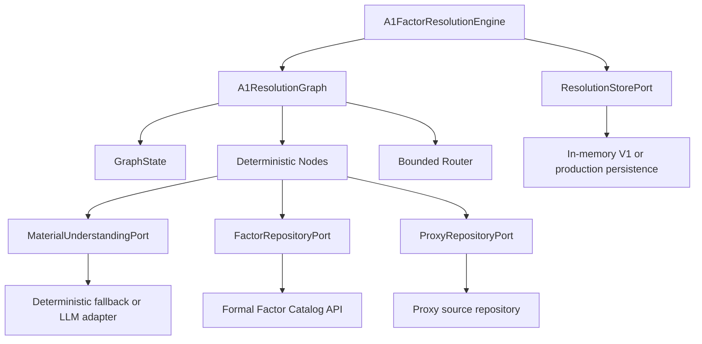
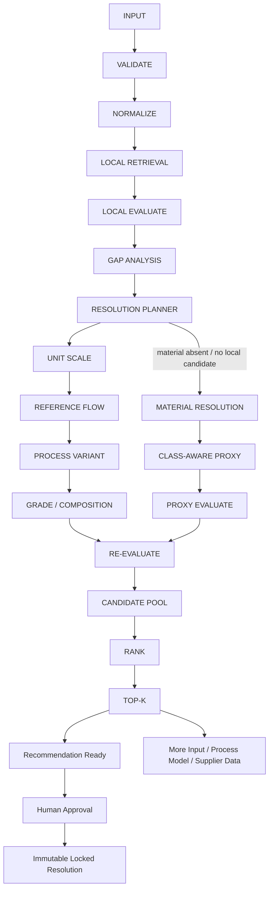
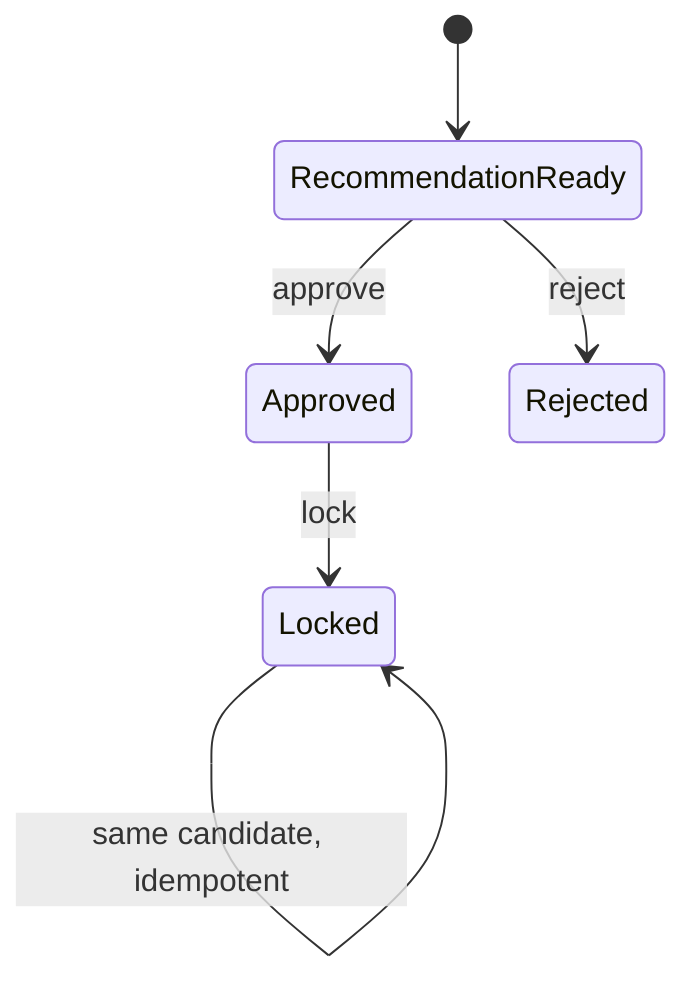

# OFR 完整技术文档

> 文档对象：当前仓库中的 A1 Factor Resolution Engine V1（下文简称 OFR）  
> 实现版本：`0.12.2`（会计量化状态、Reviewable 终态语义与严格目录优先级类型）
> 技术基线：Python 3.11+  
> 文档日期：2026-08-21
> 文档性质：以当前代码为准的架构、接口、算法与运行说明

## 1. 文档目的

OFR 用于解决 A1 原材料排放因子缺失、命名不一致和“不完全匹配”的问题。系统先召回可追溯来源，再结构化识别 Unit、Reference Flow、Process、Grade/Composition 与 Material Absence Gap；可解差异通过有来源参数和版本化公式转换，材料类别代理仅作为最后一级后备，最终返回分层 Top-K 供人工审批和锁定。

本文面向：

- 碳核算和 LCA 方法人员；
- 因子库和数据治理人员；
- 后端、算法和 LLM 集成人员；
- 系统审核、测试与运维人员。

本文严格区分：

- **已实现**：当前仓库可以直接运行的能力；
- **接口预留**：已定义 Port，但需要正式基础设施实现；
- **后续能力**：当前没有实现，不能当作现有功能使用。

## 2. 业务目标与边界

### 2.1 业务目标

给定材料活动数据，系统应回答：

1. 输入是否有效，活动量和因子单位能否统一；
2. 当前正式因子库中是否存在目标材料的直接因子；
3. 若不存在，是否存在明确登记的同义词匹配；
4. 若本地候选不足，材料属于什么类别；
5. 哪些材料可以作为技术上合理的 Proxy；
6. 候选为什么被保留、排除和排序；
7. 使用的是哪个正式因子库版本；
8. 相同请求在数据库更新前后为什么结果不同；
9. 最终由谁审批、锁定了哪个因子。

### 2.2 当前范围

当前实现包括：

- 请求校验与活动标准化；
- 本地正式目录的 exact/synonym/related-candidate 检索；
- 候选语义评估接口；
- Candidate Gap Analysis 与多步骤 Resolution Planner；
- Unit/Reference Flow、Process Variant、Grade/Composition 与 Class-aware Material Proxy 四类 Router；
- `ParameterEvidence`、版本化公式、派生候选和完整 lineage；
- 多维适用性、Evidence Coverage、Resolution Strength、结果分层与 Top-K；
- 可更新 Trace 与数据库版本锚点；
- 人工审批、拒绝和不可变结果锁定；
- equivalent-request Trace 差异比较。
- 独立、只读、带版本锚点的工艺能耗证据数据库及 Process Router 适配器。

### 2.3 明确不在当前范围内

- 独立的 External Retrieval / External Evaluate 图节点；
- 自动抓取网页、EPD 注册平台或文献数据库；
- 完整 Brightway foreground runtime 或任意化学反应自动建模；
- 供应商数据采集工作流；
- 生产级身份认证、权限和多租户；
- 分布式事务、消息队列和持久化数据库实现；
- 自动批准或自动锁定候选；
- 由 LLM 生成排放因子数值。

外部数据库、EPD、文献和供应商数据仍可作为 `SourceRecord` 的来源类型进入 Repository，但当前没有专门的外部检索图分支。

## 3. 设计原则

### 3.1 Direct-first

目标材料本身的数据优先。Material Class 不提前参与本地路由，Proxy 仅作为本地候选不足后的后备路径。

### 3.2 数值与语义职责分离

LLM 或其他语义模型负责：

- 材料理解和规范名称建议；
- 别名建议；
- 材料类别识别；
- 对给定候选的适用性判断和限制说明。

确定性代码负责：

- 单位转换；
- 匹配策略执行；
- 维度评分；
- Gap Analysis、Resolution Planner 与版本化派生公式；
- 结果分层、排名与 Resolution Strength；
- 状态转换；
- Trace 和锁定约束。

### 3.3 Provenance-first

原始因子只能通过 `SourceRecord` 进入系统；派生参数只能通过 `ParameterEvidence` 进入。每个派生值必须保存基础 Source ID、Parameter ID、Formula ID、输入、输出、假设和警告。LLM 不能返回裸数值作为候选或参数。

### 3.4 有界失败

图无循环。Local 和 Proxy 都无法给出合格候选时，系统进入 `supplier-data` 或 `process-model` 后续状态，而不是无限重试。

### 3.5 Solve-first

工艺、组成、形态、地域、时间和部分字段缺失优先转为 Gap、Assumption、Limitation 和较低 Resolution Strength。只有数学无效、维度不兼容、数值不可追溯或重复计算风险才硬阻断派生值。

## 4. 总体架构



架构采用 Ports and Adapters：Graph 和领域模型不依赖具体数据库、LLM SDK 或 Web 框架。当前包没有运行时第三方依赖。

## 5. Graph Engineering 流程



### 5.1 Stage 列表

| Stage | 作用 | 主要输出 |
|---|---|---|
| `input` | 构造运行状态 | `GraphState`、初始 Trace |
| `validate` | 显式记录请求已通过模型校验 | Audit/Trace event |
| `normalize` | 材料理解、文本和数量标准化 | `NormalizedActivity` |
| `local_retrieval` | exact/synonym 正式目录检索 | `RetrievalResult` |
| `local_evaluate` | 本地候选语义与确定性评分 | Local candidates/exclusions |
| `gap_analysis` | 结构化识别目标与候选差异 | `ResolutionGap[]` |
| `resolution_planner` | 按依赖顺序选择一个或多个 Router | `ResolutionPlan` |
| `unit_scale_resolution` | 活动量和因子比例单位换算 | versioned transformation |
| `reference_flow_resolution` | 依据重量/规格把件数等转换为质量 | scenarios / required fields |
| `process_variant_resolution` | 过程拆分重构、Delta 或未调整工艺代理 | derived/process proxy |
| `grade_composition_resolution` | 同系列插值或最近牌号代理 | derived/grade proxy |
| `material_resolution` | 延迟识别材料类别 | `MaterialClass` |
| `proxy_resolution` | 按类别召回 Proxy 来源记录 | Proxy records/link attempt |
| `proxy_evaluate` | 对 Proxy 做多维评估 | Proxy candidates/exclusions |
| `re_evaluate` | 汇总 lineage、假设、警告和派生结果 | `DerivedFactorCandidate[]` |
| `candidate_pool` | 按 Candidate ID 保留多情景 | Candidate pool |
| `rank` | 按 Resolution Type/Strength 稳定排序 | Ranked candidates |
| `top_k` | 结果分层、Top-K 和后续状态 | `Recommendation` |
| `terminal` | 结束本次图运行 | Persistable result |

### 5.2 Router

Planner 默认顺序为 Direct → Unit Scale → Reference Flow → Process Variant → Grade/Composition → Class-aware Material Proxy → Follow-up。前四类可按 Gap 组合执行；Material Class 只在本地与同材料解析无法解决时才参与。图无自动重试和自由联网分支。

## 6. GraphState

`GraphState` 是单次运行的可变工作状态，包含：

| 字段 | 说明 |
|---|---|
| `request` | 原始 `ResolutionRequest` |
| `stage` | 当前 Stage |
| `normalized` | 规范化活动 |
| `material_class` | Proxy 路径上的材料类别 |
| `local_records` / `proxy_records` | Repository 返回的来源记录 |
| `local_candidates` / `proxy_candidates` | 已评估候选 |
| `resolution_candidates` | 当前按计划逐步转换的候选 |
| `gaps` / `resolution_plans` | 结构化差异与执行顺序 |
| `reference_flow_records` / `parameter_evidence` | 派生计算输入证据 |
| `transformation_steps` / `derived_candidates` | 公式步骤与派生 lineage |
| `assumptions` / `warnings` / `required_fields` | 披露与数学缺参状态 |
| `excluded_candidates` | 无来源、单位不可转换或语义明确无效的排除记录 |
| `candidate_pool` | 去重后的候选池 |
| `ranked_candidates` | 确定性排序结果 |
| `link_attempts` | Linking strategy ledger |
| `recommendation` | 最终建议或后续状态 |
| `events` | 简化 Audit Events |
| `errors` | 标准化阶段错误 |
| `trace` | 可更新解释记录 |

State 初始化时生成：

- `trace_id = trace:{request_id}`；
- 不含 `request_id` 的业务请求指纹，用于等价请求比较。

## 7. 核心领域模型

### 7.1 ResolutionRequest

关键字段：

```text
material_name       必填
quantity            必须为有限正数
quantity_unit       默认 kg
geography           可选
year                可选，需为合理年份
product_form        可选
composition         可选
production_process  可选
boundary            默认 cradle-to-gate
target_factor_unit  默认 kgCO2e/kg
top_k               1..50，默认 3
min_score           0..1，默认 0.65；低于阈值的候选最多为 REFERENCE_ONLY，不作一刀切丢弃
request_id          默认 UUID
```

### 7.2 SourceRecord

`SourceRecord` 是原始因子数值的唯一合法入口；派生参数由 `ParameterEvidence` 单独承载：

- `source_id`、`material_name`、`provider`、`locator` 必填；
- `factor_value` 必须是有限非负数；
- `factor_unit` 必填；
- 可携带 geography、year、form、composition、process、boundary；
- `metadata` 被复制为只读 Mapping；
- `provenance` 属性从该记录确定性构造。

来源类型包括：

- `local_database`；
- `external_database`；
- `epd`；
- `literature`；
- `supplier`。

### 7.3 Candidate

Candidate 绑定：

- 唯一候选 ID；同一 Source 可因不同参数/公式形成多个情景 ID；
- 原始 `SourceRecord`；
- 与 Source ID 一致的 `Provenance`；
- 已转换到目标单位的因子值；
- 综合分、七维得分；
- reasons、limitations；
- evidence coverage 和 evidence gaps；
- `ResolutionGap[]`、Resolution Type 和 Result Tier；
- resolution strength、base Source IDs 和 Parameter Evidence IDs；
- `TransformationStep[]`、assumptions、warnings；
- 可选 resolved quantity 和 total emissions；
- Proxy 材料名和材料类别（仅 Proxy）。

若 Candidate 的 provenance 与 source 不一致，模型构造直接失败。`DerivedFactorCandidate` 额外保存完整 provenance lineage，不取代基础 Candidate 的 SourceRecord。

### 7.4 Recommendation

推荐结果包含：

- `request_id`；
- `status`；
- Top-K candidates；
- 可选 follow-up；
- 用户消息；
- 当前 Trace 引用；
- 可选向后兼容 `RecommendationConfidence` 和新 `resolution_strength` 展示结构。

### 7.5 状态枚举

| ResolutionStatus | 含义 |
|---|---|
| `recommendation_ready` | 存在可提交人工审批的候选 |
| `supplier_data_required` | 没有任何可用候选，需供应商数据 |
| `process_model_required` | 有证据候选但全部不合格，需过程建模 |
| `more_input_needed` | 数学计算缺少 Reference Flow 等必要变量 |
| `unresolved` | 已定义的通用未解决状态，当前 Top-K 分支未直接使用 |
| `locked` | 已定义的锁定状态；实际锁定由 `LockedResolution` 表示 |
| `error` | 输入无法完成标准化 |

## 8. 输入校验与活动标准化

### 8.1 模型校验

`ResolutionRequest` 在构造时完成基本校验。Validate Node 主要用于让 Graph 和 Trace 显式体现校验阶段。

### 8.2 Material Interpretation

`MaterialUnderstandingPort.interpret()` 返回：

- canonical name；
- aliases；
- product form；
- composition；
- production process。

语义实现可以由规则或 LLM 提供，但结果随后仍会进入确定性标准化。

### 8.3 版本化文本规则

`normalize_text()` 按顺序执行：

1. Unicode NFKC：`text.unicode_nfkc/v1`；
2. Unicode casefold：`text.casefold/v1`；
3. 标点/分隔符转空格：`text.separator_space/v1`；
4. 空白压缩和 trim：`text.whitespace/v1`。

若解释后的 canonical name 与规范化输入名不同，增加：

```text
material_understanding.semantic_mapping/v1
```

实际应用的 rule IDs 会进入 `NormalizedActivity` 和 Trace。

### 8.4 数量和因子单位

支持的质量单位：

| 单位 | 相对 kg |
|---|---:|
| `g` | 0.001 |
| `kg` | 1 |
| `t` / `tonne` | 1000 |
| `lb` | 0.45359237 |

因子格式支持质量排放/质量活动，例如：

- `kgCO2e/kg`；
- `kgCO2/t`；
- `kgCO2eq per kg`；
- `gCO2e/kg`。

转换公式为：

```text
value_kg_per_kg = value × numerator_to_kg / denominator_to_kg
target_value = value_kg_per_kg / (target_numerator_to_kg / target_denominator_to_kg)
```

不支持的单位会将对应来源记录记为排除项，不允许模型猜测转换关系。

## 9. Local Retrieval 与 Linking Strategies

当前策略链：

```text
exact_link → synonym_link → related_candidate_recall → class_aware_proxy_link → unresolved
```

### 9.1 exact_link

内存 Repository 将规范化 canonical name 与 `SourceRecord.material_name` 做相等比较。正式 HTTP Adapter 将 canonical query 与目录的 `name` 或 `code` 做规范化相等比较。

结果可能是：

- `matched`：唯一命中；
- `candidate_set`：多个命中；
- `no_match`：没有命中。

exact 有结果时，synonym 被标为 `skipped`，不会扩大召回集。

### 9.2 synonym_link

synonym 只使用显式声明的别名：

- Material Interpretation 提供的 request aliases；
- SourceRecord metadata 中登记的 aliases；
- 正式目录记录的 aliases。

系统不把任意子串包含或 embedding 相似当作同义词。

### 9.3 LinkAttempt

每次尝试记录：

```json
{
  "strategy": "exact_link",
  "outcome": "matched",
  "candidate_source_ids": ["source-001"],
  "reason": "canonical material name matched exactly"
}
```

Link ledger 最终通过 Top-K Trace 事件公开。

## 10. 正式因子目录接口

### 10.1 当前 Adapter

`HttpCatalogFactorRepository` 默认访问：

```text
GET http://127.0.0.1:5004/api/v2/factors/catalog
```

它在异步流程中使用工作线程执行同步 HTTP 请求，默认超时 10 秒。

### 10.2 期望响应结构

最小示例：

```json
{
  "catalog_version": "factor-catalog-v0.2.1",
  "database": {
    "name": "emission_factors.db",
    "sha256": "<64-char-lowercase-sha256>"
  },
  "records": [
    {
      "record_id": "lifecycle_factor:steel",
      "category": "lifecycle_factor",
      "code": "STEEL_COIL",
      "name": "steel coil",
      "primary_value": 1.25,
      "primary_unit": "kgCO2e/kg",
      "source": "formal source",
      "source_name": "provider",
      "document_status": "PUBLISHED",
      "aliases": [],
      "year": 2024,
      "boundary": "cradle-to-gate",
      "source_citation": "citation",
      "notes": "notes"
    }
  ]
}
```

### 10.3 数据库版本锚点

每次本地检索必须返回 `DatabaseVersionAnchor`：

- `catalog_name`；
- `catalog_version`；
- `database_sha256`；
- `locator`；
- `observed_at`。

如设置 `expected_sha256`，目录返回的 SHA-256 不一致时请求失败，避免在错误数据库版本上继续解析。

### 10.4 当前字段映射限制

HTTP Adapter 当前映射：数值、单位、年份、边界、引用、说明和目录元数据。目录中的 geography、product form、composition、production process 尚未映射到 `SourceRecord`，因此正式接入时应扩展字段契约，否则这些维度会表现为 source evidence gaps。

### 10.5 Options 接口

`/api/v2/factors/options` 可作为调用端的精简选项来源，但当前 OFR Adapter 没有调用该接口；解析仍以 `/catalog` 为准。

## 11. Local Candidate Evaluation

每条来源记录先经过：

```text
MaterialUnderstandingPort.assess_candidate(...)
```

语义评估返回：

- `eligible`；
- `note`；
- `limitations`。

若语义评估拒绝候选，来源值不会进入确定性评分；若通过，则执行单位转换和七维评分。

## 12. Proxy Resolution

### 12.1 Retrieval、Gap 与 Resolution 分离

Local Repository 先执行 exact、显式 alias，再进行有界 related-candidate recall。related 只用于把同材料工艺/牌号变体送入 Gap Analysis，不等同于 synonym。每个候选产生 `ResolutionGap[]`，Planner 再选择 Unit、Reference Flow、Process、Grade 或最终 Material Proxy。

### 12.2 Unit / Reference Flow

- 质量比例单位由 `unit.mass_scale/v1` 和 `unit.factor_scale/v1` 计算；
- 件/块/袋等 Reference Flow 必须由 `ReferenceFlowRecord` 提供正数质量证据；
- 多条重量证据生成多个情景，不平均；
- 无质量、尺寸/密度证据时返回 `MORE_INPUT_NEEDED`。

### 12.3 Process Variant

支持三种模式：

1. `DECOMPOSE_AND_REBUILD`：从参考因子扣除有证据的参考过程并加入目标过程；
2. `DELTA_ADJUST`：只调整有证据支持的差量；
3. `UNADJUSTED_PROCESS_PROXY`：无法拆分时保留原因子和工艺差异，不伪造修正值。

公式和参数单位被确定性校验；重复参数、份额不闭合、负值、无来源或从未包含的过程中扣除都会阻止派生值。

### 12.4 Grade / Composition

- 同一 provider、boundary、production process 系列的上下界 SourceRecord 可执行 `grade.linear_interpolation_same_series/v1`；
- 只有一个牌号时返回不修改数值的 `GRADE_PROXY`；
- 禁止按 `target purity / source purity` 缩放总因子。

### 12.5 Class-aware Material Proxy

仅在直接与同材料解析仍无解时调用 `ProxyRepositoryPort`。材料类别至少包含 natural mineral、manufactured mineral、synthetic chemical、metal、recycled material、byproduct、energy carrier 和 unknown。当前离线分类与内存召回是可替换 fallback；自然矿物、制造矿物和合成化学品使用不同技术维度权重，返回 technical/generic Top-K 而非唯一预设代理。

## 13. 多维评分算法

### 13.1 通用维度匹配

对 process、form、composition、geography、boundary 使用：

| 条件 | 分数 |
|---|---:|
| 完全相等 | 1.00 |
| 查询/候选 token 集合包含 | 0.80 |
| Jaccard token overlap ≥ 0.35 | 0.65 |
| 任一侧缺失，或双方均缺失 | 0.50 |
| 明确不匹配 | 0.00 |

当前 token 提取规则主要识别 `[a-z0-9]+`。中文字段通常依赖完全相等、Material Understanding 的 canonicalization 或结构化字段，而不是英文式 token overlap。

### 13.2 时间匹配

| 年份差 | 分数 |
|---|---:|
| 0 | 1.00 |
| ≤3 年 | 0.80 |
| ≤10 年 | 0.50 |
| >10 年 | 0.20 |
| 缺失 | 0.50 |

### 13.3 Direct 权重

| 维度 | 权重 |
|---|---:|
| material | 0.25 |
| process | 0.20 |
| form | 0.10 |
| composition | 0.15 |
| geography | 0.10 |
| time | 0.10 |
| boundary | 0.10 |

### 13.4 Proxy 权重

| 维度 | 权重 |
|---|---:|
| material class | 0.10 |
| process | 0.25 |
| form | 0.15 |
| composition | 0.20 |
| geography | 0.10 |
| time | 0.10 |
| boundary | 0.10 |

综合分：

```text
score = round(Σ weight_dimension × dimension_score, 6)
```

## 14. Evidence Coverage

Evidence Coverage 与适用性得分分开计算，避免“缺失信息得到中性分”被误解为证据充分。

对于每个加权维度，只有目标侧和来源侧都存在数据时，才计入 covered weight：

```text
evidence_coverage = covered_weight / total_weight
```

缺口分别记录：

- `missing_target_<dimension>`；
- `missing_source_<dimension>`。

这些缺口会进入 `Candidate.evidence_gaps`，并汇总到 limitations。

## 15. 最小硬约束

`min_score` 为兼容旧请求保留，但不再决定“有没有结果”：低于阈值的候选仍可见，但最多进入 `REFERENCE_ONLY`。Process、composition、form、material、geography、time 和证据缺失优先成为 Gap、Assumption 或 Limitation。

V1 只硬阻断：

- 原始数值不来自 `SourceRecord` / `ParameterEvidence`；
- 非有限、负因子、零/负良率或单位维度不兼容；
- 从不含某过程的因子扣除该过程；
- 把已含生产阶段的值再次当纯上游叠加，或重复加入同一活动；
- 派生 lineage 无法回溯基础因子、参数和 Formula ID。

## 16. Candidate Pool 与排名

### 16.1 多情景保留

Pool 按 `candidate_id` 去重，而不是 Source ID。同一基础因子使用多个 Reference Flow 证据或不同派生路径时必须保留为独立情景。

### 16.2 稳定排序

排序键为：

```text
(resolution_type_priority, -resolution_strength, -score,
 -evidence_coverage, assumption_count, source_id, candidate_id)
```

类型顺序为 Direct Exact → Direct Alias → Unit/Reference Flow → Process Adjusted → Grade Interpolated/Adjusted → Grade Proxy → Unadjusted Process Proxy → Class Technical → Class Generic。类型内再比较 strength、适用性、证据、假设和稳定 lineage。

## 17. Resolution Strength

Candidate strength 综合适用性、Evidence Coverage、来源质量、派生步骤和假设影响。Recommendation 级展示值再结合 Top-2 strength margin：

```text
margin = max(0, top_strength - second_strength)
margin_signal = min(1, margin / 0.20)

display_strength = round(
    0.65 × top_strength
  + 0.20 × top_evidence_coverage
  + 0.15 × margin_signal,
  6
)
```

若只有一个候选，当前实现的 margin 为 0，而不是假设其具有最大区分度。

等级：

| 条件 | Level |
|---|---|
| value ≥ 0.80 | high |
| value ≥ 0.65 | medium |
| value < 0.65 | low |

该值不是统计概率。为 API 向后兼容，`Recommendation.confidence` 与新 `resolution_strength` 暂时返回同一结构；它们不替代人工审批。

## 18. Top-K 与后续状态

### 18.1 有可追溯候选

- 候选分为 `PRIMARY_RECOMMENDATION`、`USABLE_WITH_ASSUMPTIONS`、`REFERENCE_ONLY`；
- 普通 Top-K 只从通过全部门禁的 eligible 候选截取，不再用被排除候选填充剩余名额；
- `PRIMARY_RECOMMENDATION` / `USABLE_WITH_ASSUMPTIONS` 返回 `recommendation_ready`；
- 没有普通候选但存在非硬阻断的 `REFERENCE_ONLY` 时，返回 `reference_review_required`，只能通过带理由的 Reference Override 审批。

### 18.2 无可计算候选

- Reference Flow 缺少必要质量依据：`more_input_needed` + 精确 required fields；
- 无任何 traceable factor：`supplier_data_required`；
- `UNADJUSTED_PROCESS_PROXY` 或仍带 Process Variant Gap：`process_model_required`；候选只保留在 Trace/exclusions，不进入 Recommendation；
- 所有有界路径结束后 Link ledger 追加 `unresolved/no_match`，不重试。

## 19. Trace 与数据库更新解释

### 19.1 Trace 性质

`ResolutionTrace` 是可追加、可替换保存的运行解释记录，不是不可变快照。它包含 revision 和按时间追加的 `TraceEntry`。

Trace 能回答：

- 使用了哪个目录和 SHA-256；
- 输入如何规范化；
- 本地命中了什么；
- exact/synonym/Proxy/unresolved 各做了什么；
- 为什么进入 Proxy；
- 哪些候选被排除；
- 候选如何排名；
- 最终选择了哪些候选；
- 推荐置信度如何组成；
- 后续发生了什么审批和锁定事件。

### 19.2 Request Fingerprint

指纹包含业务输入、Top-K 和阈值，但排除每次运行生成的 request ID。等价业务请求因此可以跨数据库版本比较。

### 19.3 compare_traces

`compare_traces(before, after)` 要求两个指纹相同，比较：

- database anchor 是否变化；
- local hit source IDs 是否增减；
- exclusion set 是否变化；
- deterministic ranking 是否变化。

返回结构同时给出 before/after database、增删命中、排序和解释列表。

### 19.4 当前 Trace 保证边界

Trace 可更新，因此后续写入会改变同一 Trace 的 revision。锁定结果的不可变性由 `LockedResolution` 和 Store 约束保证，而不是依赖 Trace 快照。

## 20. 人工审批与锁定



### 20.1 approve

`recommendation_ready` 可按结果层级审批；`reference_review_required` 只接受带理由的 `reference_override`。候选必须存在于 Recommendation 中。审批边界再次调用候选本地硬门禁，`UNADJUSTED_PROCESS_PROXY` 或未闭合 Process Variant Gap 即使因存储篡改重新出现也拒绝审批。

### 20.2 reject

候选必须存在于 Recommendation 中。拒绝动作写入 Store 和 Trace。

### 20.3 lock

锁定前必须存在 `APPROVED` 记录。锁定边界独立重查硬门禁、审批模式和“因子 × 规范化数量 = 总量”一致性，再产生 frozen `LockedResolution` 并写入状态为 `LOCKED` 的 ApprovalRecord。

锁定语义：

- 同一请求、同一候选重复锁定：幂等返回已有结果；
- 同一请求改锁其他候选：报错；
- 锁定后继续更改审批：Store 拒绝；
- Trace 仍可继续追加运行事件。

## 21. Async Ports

### 21.1 MaterialUnderstandingPort

```python
class MaterialUnderstandingPort(Protocol):
    async def interpret(request) -> MaterialInterpretation: ...
    async def classify(activity) -> MaterialClass: ...
    async def assess_candidate(activity, source, origin, material_class=None) -> SemanticAssessment: ...
```

生产实现必须约束模型只能评估传入的 SourceRecord，不得让模型创建来源 ID 或因子值。

### 21.2 FactorRepositoryPort

```python
async def search(activity: NormalizedActivity) -> RetrievalResult
```

必须同时返回 SourceRecords、DatabaseVersionAnchor 和 LinkAttempts。

### 21.3 ProxyRepositoryPort

```python
async def search(activity, material_class) -> Sequence[SourceRecord]
```

生产实现宜使用结构化技术属性做召回，并为每条来源保留完整 provenance。

### 21.4 Resolution Evidence Ports

```python
class ReferenceFlowRepositoryPort(Protocol):
    async def search(activity) -> Sequence[ReferenceFlowRecord]: ...

class ProcessParameterRepositoryPort(Protocol):
    async def search(activity, reference) -> Sequence[ParameterEvidence]: ...

class GradeSeriesRepositoryPort(Protocol):
    async def search(activity, reference) -> Sequence[SourceRecord]: ...
```

这些 Port 只提供证据，不执行自由联网搜索，也不能返回无 provider/locator 的裸参数。

### 21.5 ResolutionStorePort

定义 Recommendation、Trace、Approval 和 LockedResolution 的保存与查询接口。生产实现需要自行提供事务、唯一约束、并发控制和持久化。

## 22. 当前 Adapters

| Adapter | 用途 | 生产状态 |
|---|---|---|
| `InMemoryFactorRepository` | 测试、示例和离线记录 | 非生产持久化 |
| `HttpCatalogFactorRepository` | 读取正式目录 API | 可接入，字段映射仍需增强 |
| `NullFactorRepository` | 未配置本地库时显式 no-match | 可作为安全默认值 |
| `InMemoryProxyRepository` | 类别/family 宽召回 | 参考实现 |
| `NullProxyRepository` | 未配置 Proxy 时返回空集 | 可作为安全默认值 |
| `InMemoryReferenceFlowRepository` / Null | Reference Flow 参数情景 | 参考实现 |
| `InMemoryProcessParameterRepository` / Null | 工艺拆分/Delta 参数 | 参考实现 |
| `InMemoryGradeSeriesRepository` / Null | 同系列牌号锚点 | 参考实现 |
| `DeterministicMaterialUnderstanding` | 离线规则 fallback | 参考实现 |
| `InMemoryResolutionStore` | 单进程测试和演示 | 非生产存储 |

## 23. LLM 接入约束

推荐的 LLM Adapter 应满足：

1. 输入输出使用结构化 Schema；
2. interpret 阶段不得输出数值因子；
3. classify 阶段只输出类别、family、理由和置信度；
4. assess 阶段只能引用传入的 Source ID；
5. 不允许修改 SourceRecord 的因子值、单位或 provenance；
6. 模型超时或解析失败时应返回可解释 fallback，而不是中断到无限重试；
7. 模型名称、版本、prompt 版本和原始响应摘要宜写入 Trace；
8. 最终资格、排名和锁定继续由确定性代码控制。

当前仓库未提供具体 LLM SDK Adapter。

## 24. API 使用示例

### 24.1 解析

```python
from a1_factor_engine import A1FactorResolutionEngine, ResolutionRequest
from a1_factor_engine.adapters import HttpCatalogFactorRepository

engine = A1FactorResolutionEngine(
    local_retrieval=HttpCatalogFactorRepository(
        endpoint="http://127.0.0.1:5004/api/v2/factors/catalog",
        expected_sha256="799bff31f6cae963d07441b2ac8f7439f27628fef0f9586bbc5f5e38b8434e06",
    )
)

request = ResolutionRequest(
    material_name="steel coil",
    quantity=1,
    quantity_unit="t",
    geography="CN",
    year=2024,
    product_form="coil",
    composition="carbon steel",
    production_process="electric arc furnace",
    boundary="cradle-to-gate",
    top_k=3,
)

recommendation = await engine.resolve(request)
```

### 24.2 查看解释

```python
trace = await engine.trace(request.request_id)
explanation = trace.explain()

print(explanation["database_version"])
print(explanation["local_retrieval"])
print(explanation["proxy_decision"])
print(explanation["link_attempts"])
print(explanation["excluded_candidates"])
print(explanation["final_ranking"])
print(explanation["confidence"])
print(explanation["resolution_strength"])
print(explanation["candidate_gaps"])
print(explanation["transformation_steps"])
```

### 24.3 审批和锁定

```python
candidate_id = recommendation.candidates[0].candidate_id
await engine.approve(request.request_id, candidate_id, "reviewer-a", "source checked")
locked = await engine.lock(request.request_id, candidate_id, "reviewer-a")
```

### 24.4 比较数据库更新前后结果

```python
difference = await engine.compare_traces(before_request_id, after_request_id)
print(difference["database_changed"])
print(difference["local_hits_added"])
print(difference["local_hits_removed"])
print(difference["ranking_before"])
print(difference["ranking_after"])
```

## 25. 错误处理

| 场景 | 当前行为 |
|---|---|
| 请求字段非法 | dataclass 构造抛出 `ValueError` |
| 非质量 Reference Flow 且有重量证据 | 生成一个或多个确定性转换情景 |
| 非质量 Reference Flow 且无重量证据 | `MORE_INPUT_NEEDED` + required fields |
| 来源因子单位不支持 | 该来源进入 CandidateExclusion |
| 目录缺少 database/records | HTTP Adapter 抛出 `ValueError` |
| SHA-256 不匹配 | HTTP Adapter 抛出 `ValueError` |
| 未知 request/candidate | 审批接口抛出 `KeyError` |
| 未审批直接锁定 | 抛出 `ValueError` |
| 已锁定后改锁其他候选 | 抛出 `ValueError` |
| Local/Proxy 均无结果 | supplier-data follow-up |
| 派生参数单位/数学无效 | 阻止派生值，保留可追溯的未调整参考候选和 warning |

Graph 当前没有统一捕获 Repository、LLM 或 Store 的运行时异常。生产服务层应增加超时、错误映射、可观测性和有限重试策略。

## 26. 测试与验证

当前测试集包含 56 个场景。基础覆盖包括：

1. 合格 Local Candidate 绕过 Proxy；
2. Material Class 仅在 Proxy 路径调用；
3. 无结果时有界进入 supplier-data；
4. process 冲突转为 Gap 和未调整工艺代理；
5. 数量和因子单位转换；
6. Candidate provenance invariant；
7. 审批前不可锁定及锁定不可变；
8. Trace 解释 local hits、Proxy 路由、排除和排名；
9. 相同请求跨数据库版本差异；
10. HTTP 正式目录和 SHA 锚点；
11. 合格 exact 截断后续候选；无效 exact 允许显式 synonym 继续；
12. synonym 必须显式登记；
13. 规范化规则、证据覆盖率和置信度可观察；
14. 全策略失败后显式 unresolved attempt；
15. 多个 Reference Flow 重量证据生成独立情景；
16. 无 Piece-to-mass 证据返回精确 required fields；
17. 烧结莫来石拆分重构为电熔莫来石 `2.701546778`；
18. 无被扣除过程证据时禁止叠加目标生产能源；
19. 同系列 90%/97% 锚点插值得到 95%；
20. 单一牌号保持原值并标记 `GRADE_PROXY`；
21. 材料缺失返回非硬编码的 class-aware Top-K；
22. Reference Flow → Process → Grade 多 Gap 顺序与 lineage；
23. Class-aware Proxy 对件数活动仍必须取得 Reference Flow 证据；
24. 声明不含参考过程的 SourceRecord 禁止执行 Delta 扣除；
25. related-candidate recall 不得伪装成 Direct Exact；
26. Process 共同上游非负、能源份额完整、显式 includes-process 和参数作用域；
27. Grade exact anchor 优先、series/provider/process/declared-product/unit 完整资格；
28. emission-limit 和跨 series 记录不得成为 Grade Anchor；
29. Proxy family 差异成为 Gap，并按声明依赖执行一次 Grade → Process 解析；
30. Proxy 因子单位转换保留独立 TransformationStep；
31. `score < min_score` 与 unknown kind/indicator 只可进入 REFERENCE_ONLY；
32. `1 t` 与 `1000 kg` 共享 normalized business fingerprint；
33. 重复 request_id 不得拆分 Recommendation 与 Trace；
34. HTTP Catalog 保留上游提供的 document locator/SHA/page/table/row；
35. m³/m²/袋/卷等 reference flow 返回与功能单位相符的问题；
36. 未验证 supplier 标签不能自动获得最高来源质量；
37. Steel Fiber 请求缺口、记录类型、产品限定单位与审批模式；
38. 其余回归覆盖 Trace、排序、锁定、数据库锚点和终止状态。

推荐验证命令：

```powershell
uv lock --check
uv run --extra test python -m pytest -q
uv run --extra test python -m compileall -q src tests
uvx ruff check --select I,F src tests
```

## 27. 部署与运行建议

### 27.1 当前开发运行

```powershell
pip install -e .[test]
pytest
```

### 27.2 生产服务建议

OFR 当前是 Python Library，不包含 HTTP Server。生产封装建议：

- 在 Web API 层构造 `ResolutionRequest`；
- 将 Engine 作为应用服务依赖注入；
- 为每个外部 Port 配置独立 timeout；
- 将 Store 替换为事务型持久化实现；
- 对 request ID、candidate ID、reviewer 和 lock 写入唯一约束；
- 为目录 SHA 不匹配建立告警；
- 记录延迟、候选数量、Proxy 进入率、unresolved 率和人工改选率；
- 不在日志中输出受限数据库全文或未经授权的供应商数据。

### 27.3 并发说明

GraphState 为单次请求新建，不共享；但当前 `InMemoryResolutionStore` 和 Repository 的可变列表没有生产级并发保护。多进程部署必须使用外部持久化和数据库级锁/唯一约束。

## 28. 数据治理与安全

### 28.1 数据治理

- Source ID 应在正式目录内稳定且唯一；
- alias 应有维护来源和版本，不能由运行时静默写回；
- 因子边界、地区、年份、过程和产品形态应结构化存储；
- 正式目录发布应产生版本号和 SHA-256；
- 删除或替换来源记录时应保留变更日志；
- LockedResolution 应引用审批时使用的候选内容。

### 28.2 安全

- 目录 Adapter 当前是只读 GET；
- `expected_sha256` 用于防止连接到非预期数据库版本；
- provider/locator/citation 是审计必需数据，不应被 LLM 重写；
- 生产系统应对供应商数据和商业数据库许可实施访问控制；
- LLM 输入应最小化，避免上传受版权或合同限制的数据库全文。

## 29. 已知限制

1. 默认材料理解仅为简单关键词规则；
2. InMemory Proxy 召回只按 class/family 文本筛选；
3. 没有向量召回、材料本体、工艺图谱或成分区间匹配；
4. 中文 token overlap 能力有限；
5. 地域仅按文本通用维度匹配，没有国家/区域层级距离；
6. 时间评分固定为分段规则，没有行业差异；
7. 系统边界只做文本匹配，没有模块集合语义；
8. HTTP Adapter 未映射全部技术字段；
9. 当前 Store 非持久化，进程退出后数据丢失；
10. Trace 是可更新记录，不是加密签名或不可变快照；
11. 没有 Graph-level 异常恢复和超时治理；
12. `ResolutionStatus.UNRESOLVED` 和 `LOCKED` 目前不是主要 Graph 返回状态；
13. Resolution Strength 是规则信号，尚未使用人工审批历史做统计校准；
14. 当前测试以单元/集成为主，没有真实正式目录在线验收。

## 30. 推荐演进路线

### P0：正式接入闭环

- 完成正式目录所有技术字段映射；
- 建立生产 Store 和数据库唯一约束；
- 为正式目录、Proxy Repository 和 LLM Adapter 增加超时与错误分类；
- 使用真实目录进行契约测试和在线验收；
- 定义审批角色和锁定权限。

### P1：Proxy Resolution 生产化

- 建立材料类别、产品形态、工艺路线和成分本体；
- 使用结构化过滤做强约束，再使用 embedding 做宽召回；
- 对合金成分、再生料比例、能源路线和区域电力增加专门特征；
- 让 LLM 仅在 bounded candidate IDs 内提供语义证据；
- 增加“none match / not sure / input unclear”人工选项。

### P2：评估与校准

- 建立已审批 gold set；
- 评估 Recall@K、MRR、Top-1 acceptance、Proxy rejection 和 unresolved rate；
- 按材料族校准召回、result tier 和 resolution strength；
- 监控数据库更新前后结果漂移；
- 建立人工改选原因分类。

### P3：运行治理

- 增加 Trace Schema 版本；
- 增加目录/规则/模型版本组合标识；
- 增加可恢复任务和供应商数据回填工作流；
- 如合规要求提高，再评估不可变审计快照或签名，而非当前阶段提前实现。

## 31. 关键监控指标

建议生产环境记录：

- local exact hit rate；
- synonym hit rate；
- Proxy entry rate；
- Proxy recommendation-ready rate；
- supplier-data/process-model rate；
- 平均候选数量和 Top-1/Top-2 margin；
- evidence coverage 分布；
- result tier 和 low/medium/high resolution-strength 分布；
- 人工接受率、改选率、拒绝率；
- 目录版本更新后的排名变化率；
- Repository、LLM 和 Store 延迟/错误率；
- 锁定冲突和幂等重试数量。

这些指标用于质量治理，不应直接替代逐候选的 Trace 和人工判断。

## 32. 上游思想来源

当前设计借鉴但不直接复制：

- [FAULDIER](https://github.com/ljlazar/fauldier)：语言、拼写、单位和地域 harmonization，以及受限的 LCI mapping；
- [Amazon carbon-assessment-with-ml](https://github.com/amazon-science/carbon-assessment-with-ml)：bounded retrieval、Candidate Matching 和 Ranking；
- [Brightway2-io](https://github.com/brightway-lca/brightway2-io)：顺序 linking strategies、unlinked state 和中间结果可观察性。

OFR 的关键差异是：Candidate Gap Analysis、四类 Resolution Router、版本化确定性公式、Derived Factor Lineage、Solve-first Result Tiers、人审和锁定始终保留在 LLM 之外。

## 33. 代码导航

| 文件 | 责任 |
|---|---|
| `src/a1_factor_engine/models.py` | 领域模型、Trace、状态枚举和约束 |
| `src/a1_factor_engine/ports.py` | Async Port 协议 |
| `src/a1_factor_engine/graph.py` | GraphState、Stage 和有界路由状态 |
| `src/a1_factor_engine/nodes.py` | Gap/Planner/Router Node、评分、Top-K |
| `src/a1_factor_engine/qualification.py` | Direct/Proxy/Grade Anchor 共用资格策略 |
| `src/a1_factor_engine/material_registry.py` | 版本化 Material/Process/Form Rules、Typed Relations 与待审建议契约 |
| `src/a1_factor_engine/semantic_index.py` | 正式目录预解析、Entity/Reviewed Alias/Same-Entity 分层索引与版本锚点 |
| `src/a1_factor_engine/energy_database.py` | 能耗证据库 Schema、Builder、版本锚点和 Process 参数 Adapter |
| `src/a1_factor_engine/gap_analysis.py` | 结构化 Candidate Gap Analysis |
| `src/a1_factor_engine/resolution_planner.py` | 依赖有序的 Resolution Plan |
| `src/a1_factor_engine/unit_resolution.py` | 版本化比例单位转换 |
| `src/a1_factor_engine/reference_flow_resolution.py` | Piece-to-mass 多情景转换 |
| `src/a1_factor_engine/process_adjustment.py` | 过程拆分重构、Delta 和未调整代理 |
| `src/a1_factor_engine/grade_resolution.py` | 同系列插值和最近牌号代理 |
| `src/a1_factor_engine/derived_factor.py` | 派生候选、结果分层和 strength |
| `src/a1_factor_engine/matching.py` | 文本标准化和 Recommendation strength 展示 |
| `src/a1_factor_engine/units.py` | 确定性单位转换 |
| `src/a1_factor_engine/adapters.py` | 内存、Null、HTTP 和默认语义 Adapter |
| `src/a1_factor_engine/engine.py` | Graph 编排、Facade、审批、锁定和 Trace 比较 |
| `tests/test_engine.py` | 主要行为和回归测试 |
| `tools/import_refractory_energy_standard.py` | 带来源 SHA 校验的本地标准导入工具 |

## 34. Steel Fiber Qualification V1

`0.3.0` 在数值解析前增加请求身份与记录资格边界：

- Normalize 输出 `MaterialIdentity`、`RequestGap` 和一次性 `RequestResolutionPlan`；宽泛“钢纤维”返回 `MORE_INPUT_NEEDED`，不会误写为 supplier-data 缺失；
- Related Recall 的 form-only 命中保留为 `RecallObservation`，但不进入 Candidate Pool；
- `FactorKind`、GWP indicator、declared product、boundary modules 和产品限定单位在换算前确定性校验；`EMISSION_LIMIT` 永不作为 A1 生命周期候选；
- `kgCO2e/t产品` 只表示可解析的质量分母和产品限定词，缺少相容 declared product 时仍不可换算；
- `REFERENCE_ONLY` 只能通过带理由的 `REFERENCE_OVERRIDE`，`USABLE_WITH_ASSUMPTIONS` 需要 `ASSUMPTION_ACCEPTANCE`，锁定 Trace 保留模式、理由、假设和警告。

HTTP Catalog Adapter 已支持上述字段，正式目录仍由外部只读端口管理。本仓库没有自动写入正式数据库；两条钢纤维 EPD 可在数据治理审批后通过目录端口接入，其设计验收值明确对应 A1-A3 `GWP-total`。

## 35. Major Fixes V1

`0.4.0` 对公开审核发现的数值、候选和审计一致性风险进行了收敛：

- Process Router 在替换与 Delta 公式中先验证 `common_upstream = reference - removed >= 0`；目标能源份额必须完整，参考因子必须显式声明包含待扣除过程；参数端口必须显式绑定 reference source、target material 和 target process。
- Grade Router 使用 `exact-grade anchor → qualified bracket interpolation → qualified nearest grade → unchanged proxy`；锚点必须显式同 series，并通过 factor kind、GWP indicator、declared product、process、boundary、unit 和 provider 检查。地域与年份仍作为适用性和排序证据。
- `QualificationPolicy.DIRECT/PROXY/GRADE_ANCHOR` 共用同一资格引擎。Proxy 的 family、form、grade 和 process 差异进入 Gap；材料类别、生命周期语义、指标、边界、单位及 provenance 仍受约束。
- Class-aware Proxy 在评估后只进行一次有界的 Gap/Planner/Unit/Reference Flow/Grade/Process 回送；Grade 与 Process 的先后由来源的 `resolution_order` 依赖声明决定，不引入循环 Agent。
- 相同 `request_id` 在执行前和原子保存时均被拒绝；首个 Recommendation 与 Trace 由 `save_resolution_run()` 同步绑定，避免新 Trace/旧 Recommendation。
- Trace 同时保存 raw fingerprint 与 normalized business fingerprint；正式目录在提供字段时保留原始文档 locator/SHA-256/page/table/row。
- `score < min_score`、`FactorKind.OTHER` 或未知 indicator 的候选最多为 `REFERENCE_ONLY`；坏 Exact 不再阻断合法注册 Alias。
- 对抗测试覆盖上述不变量，GitHub Actions 固定执行 Python 3.11、lock、pytest、compileall 和 Ruff I/F。

## 36. Material Semantic Registry V1

`0.5.0` 把材料理解从散落的名称判断收敛为一个可版本化、可审核、可扩展的语义层：

`纯文本 → 标准化 → Material Rules / Process Rules / Form Rules / Typed Relations → 充分性判断`

- Request 与 SourceRecord 共用同一个 `VersionedMaterialSemanticRegistry`，避免检索侧和资格侧采用不同材料解释；
- 只有 `ACTIVE` 规则参与运行，`DRAFT`、`DEPRECATED`、`REJECTED` 均不能改变候选；
- 未识别材料可以调用可选 `MaterialRuleSuggestionPort`，但返回值固定为待审 `RegistryRuleSuggestion`，不会自动发布或携带排放因子数值；
- Normalize Trace 保存 registry version、Material/Process/Form rule IDs、relation IDs、识别充分性与待审建议；
- 内置 V1 规则覆盖莫来石、尖晶石、刚玉、氧化铝、钢等材料，以及电熔、烧结、煅烧、EAF、BOF 等过程；
- `电熔莫来石` 与 `烧结莫来石` 被识别为相同 head material 的不同 process variant，进入 Process Gap；`电熔刚玉` 不会因共享“电熔”工艺词而被误召回；
- 新材料通过新增待审规则、回归测试和 registry version 发布扩展，不需要修改 Graph、Node 或数值公式。

统一注册表是语义治理层，不是排放因子库。它不能产生、修正或推断因子数值；所有数值仍必须来自带 provenance 的 `SourceRecord` 或 `ParameterEvidence`。

## 37. Energy Evidence Database V1

`0.6.0` 在排放因子库之外增加独立的 SQLite 能耗证据库：

- `energy_quota` 保存标准发布的 1/2/3 级单位产品综合能耗限额，运行时策略显式选择 1 级；
- `energy_conversion` 区分精确折标值与范围值，范围不能自动进入确定性计算；
- `process_parameter` 保存能源份额、能源排放因子等独立证据，并可绑定参考材料、参考工艺、目标材料、目标工艺和精确参考因子 `source_id`；
- `quota_modifier_rule` 保存表格脚注条件，但没有相应输入证据时不自动加成；
- Trace 同时记录正式因子库锚点和能耗证据库锚点，以及每个参数的标准、表格、页码、证据状态和局限。

“1级”是能耗限额等级，不是“一次能源”的同义词。标准限额属于上限型工程 Proxy，不是企业实测值，也不是排放因子。完整 Process 重构仍要求能源结构、折标系数、排放因子、过程包含关系和来源作用域全部闭合。

## 38. 电熔尖晶石过程差值验证

正式目录与能耗证据库的联合测试使用请求 `电熔尖晶石，1 t，CN，2024`。语义注册表将其识别为 `head_material=spinel`、`material_family=spinel_products`、`production_process=electrofused`，置信度为 `0.90`。

本地目录召回的两条镁铝尖晶石排放限额记录因 `factor_kind_mismatch` 等资格原因被排除；烧结尖晶石生命周期因子 `4.602431 kgCO2e/kg` 可进入候选池，但目标与来源存在 `PROCESS_VARIANT_GAP`。能耗库成功返回一级能耗证据：烧结镁铝尖晶石 `375 kgce/t`、电熔镁铝尖晶石 `185 kgce/t`，以及电力折标系数 `0.1229 kgce/kWh`。

上述证据不能支持按 `185/375` 对生命周期因子整体缩放。`0.10.0` 已通过数据库优先策略接入企业表中的完整能源份额、唯一能源载体参数回退和显式过程包含假设；`0.11.0` 进一步将企业表 P:R 列的非能源过程排放解析为独立 `enterprise_process_emission` 记录。电熔尖晶石记录保存 `电极9kg`、`9×44/12` 和 `33 kgCO2/t`，烧结路线保存对应显式零值。

Process Router 执行：

```text
EF_target = EF_reference
          - EF_reference_energy
          - EF_reference_additional_process
          + EF_target_energy
          + EF_target_additional_process
```

在当前正式目录锚点下，一级结果为 `4.623698092 kgCO2e/kg`，二级为 `4.563588974`，三级为 `4.520099655`。Formula ID 为 `process.replace_energy_and_additional_process/v2`，Trace 保存 0.033 kgCO2e/kg 过程项、原始 33 kgCO2/t、P/Q/R 单元格、化学计量公式和数据库 SHA。结果仍因正式目录元数据与 Grade 资格局限被限制为 `REFERENCE_ONLY`，必须人工审批。

后续工艺和能源占比通过 `process_parameter` 或同结构的企业证据记录增量补充，不修改 Graph。每项参数必须保留来源、适用地域/年份/边界，并绑定参考因子 `source_id`、参考/目标材料和工艺；参考与目标能源份额分别必须闭合为 `1.0`，显式零值也必须提供。参数审核发布后形成新的能耗库版本锚点，相同规范化请求可重跑并解释更新前后的模式、数值和排名变化。

这项验证确立如下不变量：能耗限额是工程证据而非排放因子；不得跨材料复用未经证明的能源结构；不得用名称相似度补齐数值；参数不足时应返回有来源的未调整参考候选，而不是生成伪精确的派生因子。

## 39. Entity-first Semantic Resolution V2

`0.7.0` 将 Normalize 输出契约升级为：

```text
Normalize Text
  → MaterialMention（带角色与字符区间）
  → IdentityResolution（带实体 ID 与证明）
  → RetrievalIntent（限定允许召回的实体与限定符）
  → SemanticFactorIndex（目录 SHA + 注册表 SHA 锚定）
```

语义角色包括 `BASE_ENTITY`、`ENTITY_TYPE`、`PROCESS`、`PRODUCT_FORM`、`GRADE`、`GRADE_MODIFIER`、`PURITY`、`COATING`、`ROUTE`、`APPLICATION` 和 `CONSTITUENT`。`金属` 等限定词不会被简单删除：`金属铝` 解析为 elemental aluminium，`氧化铝` 解析为 alumina，两者具有不同 `entity_id`。复合材料保留多个 constituent ID，避免把 `莫来石-碳化硅砖` 或 `锆莫来石` 压扁成单一莫来石。

本地检索由共享 Semantic Index 统一执行：Exact Primary → Reviewed Alias → Same-Entity Variant。Related 不再使用中文 bigram、共同工艺词或单一产品形态作为候选依据；只有请求与来源都达到 `RESOLVED` 且 `base_entity_id` 相同，才允许进入候选资格评估。每条评估记录生成 `CandidateAdmission`，说明检索策略、请求身份依据、来源规则、是否进入候选池以及 hard exclusions。评分只对已准入候选排序，不能修复身份不明或身份冲突。

通用实体若对应多个产品路线，不自动选最低值或最高分。例如目录同时存在原铝与再生铝时，`金属铝` 返回 `MORE_INPUT_NEEDED`，要求选择 route/product entity。`Material Class` 仍保留在本地直接路径耗尽之后，用于指导受控 Proxy Resolution，不提前替代实体身份。

正式目录不写回仓库。HTTP Adapter 在进程内把目录记录预解析成 Semantic Index；目录 SHA、注册表版本或注册表 SHA 变化时生成新的 index version。Trace 暴露 `material_mention`、`identity_resolution`、`retrieval_intent`、`semantic_index`、`candidate_admissions`、排除原因和最终排名，支持解释同一请求在目录或注册表更新前后的差异。

`0.11.2` 的审核式 `CatalogDatasetPolicy` 只为同时匹配 category、standard 和 primary label 的记录补充来源文件已经明确规定、但目录未逐行重复的字段。当前耐火材料征求意见稿策略依据 5.2、5.3.1 和 7.1 继承 `declared_product=记录名称`、`boundary=cradle-to-gate` 和 `indicator=GWP-total`；年份与地域没有被凭空补齐。草案/征求意见、聚合和待审核来源确定性封顶为 `REFERENCE_ONLY`。只有代码侧受审 Policy 绑定非空 `production_approval_id`，才可解除该上限；应用的 policy、approval、继承字段、Tier 原因和证据章节都进入 SourceRecord metadata 与 Trace。

完整契约、迁移边界和验收案例见 `docs/OFR_SEMANTIC_RESOLUTION_V2_IMPLEMENTATION_ZH.md`。

## 40. Entity-scoped Numeric Purity Grade V1

`0.8.0` 在实体优先语义层之后增加确定性的数字角色分类和材料实体作用域 Grade Schema。处理顺序是：

```text
Numeric Token Classification
  → Explicit Chemistry
  → Reviewed Supplier / Standard Grade Schema
  → Organization Business Grade Schema
  → Unresolved Grade Basis
```

材料身份先于数字解释。`70烧结镁砂`、`80烧结镁砂` 和 `烧结镁砂90` 在 `mat.compound.magnesia` 作用域内分别形成 MgO 70/80/90 级别；`尖晶石90` 在 `mat.engineered.spinel` 作用域内形成 Al2O3 90 级别。这些默认解释的类型是 `IMPLICIT_GRADE_CLASS`，不是对“精确含量”“最低含量”或某项国家标准的无证据声明。`MgO ≥ 95%`、`MgO 90` 等显式组成证据则保留 `MINIMUM` 或 `NOMINAL` 操作符，并优先覆盖名称中的隐式牌号。

Parser 先识别反例上下文：`F80/P80` 为粒度号，`T60/CT800/CA...` 为型号，`AISI 446/6061` 为合金牌号，带 mm/µm/mesh 的数字为粒度，年份、标准号和包装规格也各有独立角色。这些数字不会被提升为纯度；同时其限定作用不会被通用材料 alias 擦除，因此 `F80碳化硅` 可以召回同实体资料，但不能把无粒度说明的通用碳化硅记录标为 Direct。

请求和 `SourceRecord` 共用同一 Parser、Grade Schema 和注册表版本。检索意图携带 grade schema/value/basis；Semantic Index digest 包含来源 Grade 身份；Qualification 检查 Grade Anchor 的 schema 与 basis；Gap Analysis 将来源 Grade 缺失、schema/basis 不一致和值不同分别记录为结构化 Grade Gap。Grade Router 只对带正式来源和完整资格的锚点执行既有确定性规则，不因请求中的 70/80/90 自动发明因子、插值或能耗调整。

多组分材料上的裸数字仍可能缺少唯一作用对象。例如 `莫来石-碳化硅砖90` 无法确定 90 指向 Al2O3、SiC 还是其他指标，此时才返回 `MORE_INPUT_NEEDED`，字段为 `numeric_grade_basis`。这保留了“减少追问”与“禁止错误确定化”的边界。

Trace 保存 `numeric_tokens`、选中/拒绝角色、Grade Schema ID/版本、basis component、interpretation、evidence scope/evidence IDs、候选 Grade Gap、资格结果和最终排名。Registry SHA 与正式因子库 SHA 共同构成可更新 Trace 的版本锚点；Grade schema/value 进入规范化业务指纹，所以 70、80、90 是不同请求，而 `1 t` 与 `1000 kg` 的数量等价性仍保持不变。

完整数据契约、默认规则、反例矩阵和验收结果见 `docs/OFR_NUMERIC_PURITY_GRADE_V1_ZH.md`。

## 41. 89 品种企业能耗与能源分配导入

`0.9.0` 将工作簿 `能碳转换碳排放核算--89个品种` 的当前数据行导入独立能耗证据库。导入器按完整产品/工艺身份解析 89 个序号中的 91 条产品路线，并将 1/2/3 级拆为 273 条 `enterprise_energy_profile` 记录。每条记录保存总能耗、电力占比、余量能源及占比、工作表、原始行号和单元格、来源说明、质量标记与工作簿 SHA。`0.11.0` 仅把 P:R 中具有明确工艺作用域的附加过程排放导入为 63 条参数证据；M:O 能源计算结果和 S:U 最终值仍只用于 QA，不作为独立生命周期因子导入。

运行时默认采用一级能耗。273 条记录中有 193 条属于预审核可用集。`0.10.0` 的数据库优先策略允许 canonical key 唯一、份额闭合且能源为天然气/电力的精确 `NEEDS_REVIEW` profile 带假设计算；来源状态不会被改写，Trace 必须保留待核实说明、工作簿 SHA、行和单元格。标准煤余量、无法识别的余量能源和重复产品键仍不会进入计算。

企业 profile 的精确数值优先于旧的同名路线参数，但不会删除来源链。若旧的受审路线证据明确证明参考生命周期因子包含待移除工艺，系统将该断言保存为独立的非数值 inclusion witness，避免企业份额覆盖后丢失工艺作用域，同时禁止旧份额重新进入计算。

当前本地数据库为 schema `5`、dataset `t-chnrisc-0008-2025+enterprise-energy-89/v4`，SHA-256 为 `0d47d6eac30e6de3ef110638506ae370aa68d87c57811b1f35a9060cef1d005a`。正式目录联调中，`烧结莫来石 → 电熔莫来石` 在能源替换后加入工作簿中的电极过程排放 `18 kgCO2/t`，输出 `3.940503304 kgCO2e/kg`；`烧结尖晶石 → 电熔尖晶石` 使用第64/61行的 `375 kgce/t, 2.1%电/97.9%气 → 185 kgce/t, 100%电`，再加入电极氧化 `33 kgCO2/t`，输出 `4.623698092 kgCO2e/kg`。

## 42. Database-priority Energy Replacement V1

`0.10.0` 固化公式 `EF_target = EF_reference - EF_reference_process + EF_target_process`。数值选择顺序是：精确企业 profile → 精确路线参数 → 唯一通用能源参数 → 正式精确折标/能耗后备。待核实的精确 profile 可以计算，但自动增加假设；通用参数必须在数据库内值和单位唯一；生命周期参考因子包含被扣除路线能源由版本化策略证据显式记录。TransformationStep 保存参考因子、烧结电/气排放、共同上游、电熔电/气排放、全部参数 ID、公式 ID、输出和假设。

`0.11.2` 仅在参考与目标两侧都存在精确附加工艺记录时选择 `process.replace_energy_and_additional_process/v2`；显式数字零是证据，空白或单侧记录缺失会阻止派生并进入 `PROCESS_MODEL_REQUIRED`。导入器采用 `blank-is-missing-skip-record/v2`，不会再把空白包装成零证据。两侧都没有过程记录时继续使用 V1 能源公式。派生因子变化后，总排放按规范化数量重新计算，锁定前再次校验一致性。

电熔尖晶石实例：`4.602431 - (0.037016985 + 0.844321293) - 0 + 0.869605370 + 0.033 = 4.623698092 kgCO2e/kg`。0.033 来自数据库中的工作簿 P61 结构化记录，不是 Router 常量；结果按现有 Qualification/ResultTier 规则展示。

## 43. 0.12.x 诊断式 Process Gap 与会计角色

`Recommendation.candidates` 继续只包含可审批候选；新增 `diagnostic_candidates`、`missing_gaps` 和 `questions`。例如查询电熔莫来石但只有烧结莫来石生命周期因子且工艺参数不闭合时，烧结因子的数值、来源和排除原因保留在诊断区，状态为 `PROCESS_MODEL_REQUIRED`，用户会收到综合能耗/能源分配、含碳耗材用量/含碳率/氧化率，以及参考因子工艺包含关系这三个最小问题。诊断候选仍无法审批或锁定。

项目明确批准的合格候选来源顺序为：耐火材料征求意见稿、ecoinvent 3.10、ecoinvent 3.12。该顺序通过 `source_priority_rank=0/10/20` 在相同 Resolution Type 内确定性排序，只在实体、边界、工艺和资格门禁之后生效。征求意见状态、Policy ID 与客户批准锚点继续进入 SourceRecord metadata 和 Trace，不会伪装成正式发布标准。

企业工作簿采用 `enterprise-energy-89.blank-zero-unless-process-trigger/v1`：空白过程排放在没有反证时解释为数据集默认零；若备注或公式出现电极、焦炭、石墨、还原剂、含碳、氧化、燃烧、分解或 `44/12`，空白/零值被标记为计算冲突，不能成为零证据。完整的含碳耗材参数按 `m_consumable × carbon_fraction × oxidation_fraction × 44/12 ÷ 1000` 计算 kgCO2e/kg；缺少任一参数即回到 `PROCESS_MODEL_REQUIRED`。

会计角色 Router 区分同一耗材的两条贡献：购入电极或焦炭的生产因子属于 `A1_UPSTREAM_INPUT`；制造现场氧化、燃烧或反应产生的直接排放属于 `A3_DIRECT_PROCESS`。独立查询“焦炭”默认返回 A1 上游角色；只有存在明确过程用途证据时才另建 A3 直接过程事件，防止把上游因子当直接排放或重复计算。

`0.12.2` 不再用一个 Assignment 同时表示成品、耗材和直接排放。目标产品以 `TARGET_PRODUCT`、空 modules 表示核算对象；电极/焦炭以独立 subject 表示 A1 购入投入；“电极现场氧化/反应”等事件以 `DIRECT_PROCESS_EMISSION / A3_DIRECT_PROCESS` 表示。每个 Assignment 新增 `quantification_status` 与 `missing_inputs`：工艺证据只证明“存在电极”时，A1 为 `IDENTIFIED_NOT_QUANTIFIED`，必须另有耗材用量和购入耗材上游因子才能成为 `QUANTIFIED`；现场氧化排放可由显式过程排放值或闭合化学计量独立量化。耗材与直接过程 Assignment 只引用 `target_*` 证据，参考烧结路线证据不会混入目标会计分项。

化学实体名与工艺上下文已严格分离。“氧化铝”“氧化镁”“二氧化硅”中的“氧化”只属于材料名称，不会触发 A3；A3 仅允许显式 `use_context` 或受控目标工艺证据中的现场氧化、燃烧、分解或直接过程排放信号触发。

Recommendation 采用三层候选合同：`candidates` 为普通审批候选，`reviewable_candidates` 为软治理限制的 `REFERENCE_ONLY` 备选，`diagnostic_candidates` 为存在工艺等硬阻断的诊断候选。软备选同时返回 `reviewable_candidate_reasons`、Candidate provenance、数值和局限；普通审批拒绝该通道，只有带非空理由的 `reference_override` 可以审核和锁定。硬诊断仍永远不可审批。

目录显式 `source_priority_rank` 采用单记录容错：只接受 `type(value) is int` 且范围为 0–1000；bool、float、数字字符串、非法字符串、负数和越界值都回退到受审 Policy 或来源版本推导的顺序，并在 Source metadata 与 Rank Trace 中记录 `source_priority_issue`。排序字段污染不再中断其他候选检索，因子核心值、单位或 provenance 损坏仍按原规则排除记录。

仅存在软审核候选时，终态为 `REFERENCE_REVIEW_REQUIRED`，消息明确说明已有可追溯候选但需要带理由的 Override。该路径不再追加 `UNRESOLVED` LinkAttempt；只有确实没有可追溯可审核候选且策略耗尽时才记录 unresolved。

## 44. 结论

当前 OFR 已形成一个独立、可测试、可解释的 A1 因子解析内核。它的核心不是“让模型猜一个数”，而是识别候选与目标之间的差异，选择可追溯的工程解析策略，把 SourceRecord、ParameterEvidence、版本化公式、假设、Top-K 和人工决策组合成一个有界 Graph。

V1 已经适合作为正式系统的领域内核和集成基线。`0.12.2` 已补齐诊断/软审核/普通候选三层合同、会计主体/模块/量化状态隔离、最小 Process Gap 问题、客户来源优先级及严格脏字段容错、数据集作用域空白零规则和含碳耗材化学计量。结构化 Error、持久化事务 Store、审核式 ProxyEdge Registry、生产级 Proxy Repository、受限 LLM Adapter、真实目录 Grade 字段治理和材料族 gold-set 验收仍是生产化前置工作。
