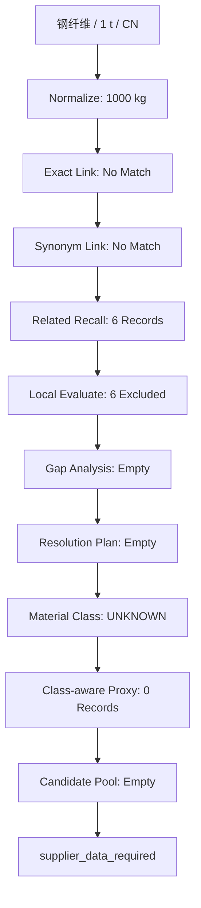
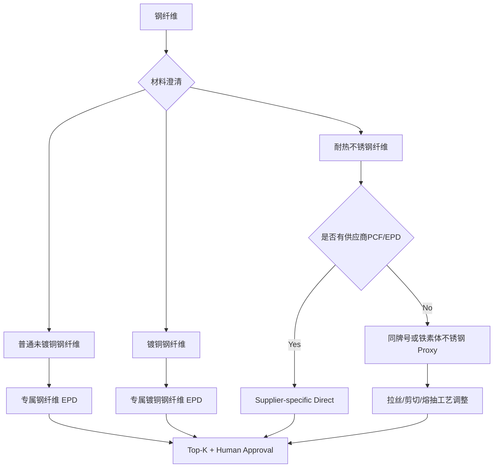

# 钢纤维因子解析 Trace 检测与问题诊断报告

> 系统：CFR / A1 Factor Resolution Engine<br>
> 软件版本：0.2.0  
> 检测日期：2026-08-20（Asia/Hong_Kong）  
> 检测类型：正式因子目录在线解析与 Trace 审查  
> 结论状态：流程有界终止正确，但材料召回、语义排除、材料分类和 Proxy 数据配置需要修正

## 1. 报告目的

本报告记录 CFR 对“钢纤维”进行正式因子解析时产生的完整 Trace，并分析以下问题：

- 为什么没有获得钢纤维候选；
- 为什么召回了6条硅酸铝耐火纤维记录；
- 这些记录实际因为什么被系统排除；
- 当前 Trace 中哪些描述与实际状态不完全一致；
- 钢纤维应如何分类、补充输入和选择因子；
- CFR 应如何修正才能正确解析普通、镀铜和耐热不锈钢纤维。

本报告只依据本次正式目录实跑结果，不将人工判断改写成已经由系统执行的判断。

## 2. 检测输入

```json
{
  "material_name": "钢纤维",
  "quantity": 1,
  "quantity_unit": "t",
  "geography": "CN",
  "boundary": "cradle-to-gate",
  "target_factor_unit": "kgCO2e/kg",
  "top_k": 10
}
```

运行标识：

```text
request_id = 8e13f870-3daa-4a3f-affa-9ee13e6e13f2
trace_id   = trace:8e13f870-3daa-4a3f-affa-9ee13e6e13f2
revision   = 14
```

最终结果：

```json
{
  "status": "supplier_data_required",
  "follow_up": "supplier-data",
  "candidate_count": 0,
  "confidence": null,
  "resolution_strength": null
}
```

## 3. 正式因子库版本锚点

本次解析使用的正式目录为：

```json
{
  "catalog_name": "emission_factors.db",
  "catalog_version": "factor-catalog-v0.2.1",
  "database_sha256": "799bff31f6cae963d07441b2ac8f7439f27628fef0f9586bbc5f5e38b8434e06",
  "locator": "http://127.0.0.1:5004/api/v2/factors/catalog"
}
```

数据库文件对应：

```text
D:\carbon-data\emission_factors.db
```

该锚点用于说明本报告结论对应哪个正式目录版本。数据库更新后，应使用等价请求重新运行并比较 Trace。

## 4. Trace 总览



本次 Graph 没有发生循环或无限重试。所有策略被有界执行一次后，系统明确进入 `supplier-data`。

## 5. 逐 Revision Trace

| Revision | Stage | 实际结果 | 判断 |
|---:|---|---|---|
| 1 | `validate` | 请求通过模型校验 | 正常 |
| 2 | `normalize` | `1 t` 转换为 `1000 kg`；名称保持“钢纤维” | 正常 |
| 3 | `local_retrieval` | exact、synonym 无命中；related recall 返回6条记录 | 召回过宽 |
| 4 | `local_evaluate` | 6条记录全部因单位不支持被排除 | 结果安全，但理由不完整 |
| 5 | `gap_analysis` | 无候选，Gap 集为空 | 符合当前实现 |
| 6 | `resolution_planner` | 无候选，无解析计划 | 符合当前实现 |
| 7 | `local_evaluate` 路由事件 | 进入 Class-aware Proxy | 路由原因文字不准确 |
| 8 | `material_resolution` | `family=unknown`、`category=UNKNOWN` | 分类错误/能力不足 |
| 9 | `proxy_resolution` | 返回0条 Proxy 记录 | Repository 未配置且分类不足 |
| 10 | `proxy_evaluate` | 0个 Proxy Candidate | 正常反映上一步结果 |
| 11 | `re_evaluate` | 无派生候选、步骤、假设或警告 | 正常 |
| 12 | `candidate_pool` | 候选池为空 | 正常 |
| 13 | `rank` | 排名为空 | 正常 |
| 14 | `top_k` | 返回0条，进入 `supplier_data_required` | 有界终止正确 |

## 6. Linking Strategy Ledger

本次实际执行的 Linking Strategy 为：

```json
[
  {
    "strategy": "exact_link",
    "outcome": "no_match",
    "candidate_source_ids": [],
    "reason": "no exact catalogue name or code match"
  },
  {
    "strategy": "synonym_link",
    "outcome": "no_match",
    "candidate_source_ids": [],
    "reason": "no registered synonym match"
  },
  {
    "strategy": "related_candidate_recall",
    "outcome": "candidate_set",
    "candidate_source_ids": [
      "emission_limit:AL_SI_FIBER_WET_VAC_SHAPED",
      "emission_limit:AL_SI_FIBER_WET_VAC",
      "emission_limit:AL_SI_FIBER_WET_CONT",
      "emission_limit:AL_SI_FIBER_NEEDLE",
      "emission_limit:AL_SI_FIBER_BLOWN",
      "emission_limit:AL_SI_FIBER_SPUN"
    ],
    "reason": "bounded catalogue material-family term recall"
  },
  {
    "strategy": "class_aware_proxy_link",
    "outcome": "no_match",
    "candidate_source_ids": [],
    "reason": "proxy retrieval constrained by the resolved material class and later suitability gates"
  },
  {
    "strategy": "unresolved",
    "outcome": "no_match",
    "candidate_source_ids": [],
    "reason": "all local and proxy strategies exhausted without a traceable resolvable candidate"
  }
]
```

## 7. Related Recall 返回的6条记录

| Source ID | 目录产品 | 原始值 | 原始单位 |
|---|---|---:|---|
| `emission_limit:AL_SI_FIBER_WET_VAC_SHAPED` | 硅酸铝耐火纤维制品（湿法真空吸滤异型） | 2562 | `kgCO2e/t产品` |
| `emission_limit:AL_SI_FIBER_WET_VAC` | 硅酸铝耐火纤维制品（湿法真空吸滤） | 1439 | `kgCO2e/t产品` |
| `emission_limit:AL_SI_FIBER_WET_CONT` | 硅酸铝耐火纤维制品（湿法连续机制） | 1148 | `kgCO2e/t产品` |
| `emission_limit:AL_SI_FIBER_NEEDLE` | 硅酸铝耐火纤维制品（针刺毯） | 281 | `kgCO2e/t产品` |
| `emission_limit:AL_SI_FIBER_BLOWN` | 硅酸铝耐火纤维棉（喷吹工艺） | 1144 | `kgCO2e/t产品` |
| `emission_limit:AL_SI_FIBER_SPUN` | 硅酸铝耐火纤维棉（甩丝工艺） | 885 | `kgCO2e/t产品` |

这些记录共同包含“纤维”，但其材料主体是硅酸铝，不是钢。它们还属于 `emission_limit` 类型，不能在未确认指标语义和边界时当作 A1 产品生命周期因子。

## 8. 系统实际排除原因

当前代码对6条记录产生的唯一排除原因是：

```text
unsupported factor unit:
unsupported factor unit: 'kgco2e/t产品'
```

因此，“因语义和产品单位不适用全部排除”是业务层总结，不是当前 Trace 的完整事实。

准确表述应为：

> 6条硅酸铝耐火纤维限额记录被相关候选召回；当前引擎在因子单位转换阶段因 `kgCO2e/t产品` 不属于已支持格式而全部排除。人工审查进一步确认，它们还存在材料族和记录类型不匹配，但这些语义理由尚未写入本次 Trace。

## 9. 为什么不能只修复单位解析

从量纲上看：

```text
1000 kgCO2e / t产品 = 1 kgCO2e / kg产品
```

但允许解析这一单位并不代表记录适用。仍需检查：

1. 材料是不是钢，而不是硅酸铝；
2. 记录是产品碳足迹因子还是排放限额；
3. 系统边界是否为目标 A1/A1–A3；
4. 数值是否为实际平均值、推荐值或监管限额；
5. 产品形态和生产工艺是否一致。

因此，本问题不能通过把 `t产品` 简单替换成 `t` 解决。正确修复顺序应先做语义和记录类型过滤，再做单位转换。

## 10. 检测发现的问题

### P1：Related Recall 材料主体约束不足

当前召回把“纤维”作为相关词，导致：

```text
钢纤维 → 硅酸铝耐火纤维
```

建议将材料解析为至少两个结构化字段：

```json
{
  "head_material": "steel",
  "product_form": "fiber"
}
```

Related Recall 必须保证 `head_material` 或 Material Family 相容。只有产品形态相同不能成为相关候选。

### P2：语义排除发生得太晚或没有发生

当前默认 `DeterministicMaterialUnderstanding.assess_candidate()` 没有识别钢与硅酸铝的冲突，候选直到单位转换才失败。

建议评估顺序改为：

```text
材料族检查
→ 记录类型检查
→ 边界检查
→ 因子语义检查
→ 单位转换
→ Gap Analysis
```

### P3：材料分类返回 UNKNOWN

本次分类结果：

```json
{
  "material_class": "钢纤维",
  "family": "unknown",
  "category": "UNKNOWN",
  "rationale": "offline deterministic fallback"
}
```

“钢纤维”至少应识别为：

```json
{
  "material_class": "steel fiber",
  "family": "steel products",
  "category": "METAL"
}
```

如果已知是446耐热钢纤维，应进一步识别为高铬铁素体不锈钢纤维。

### P4：Class-aware Proxy Repository 为空

本次引擎只配置了正式 Local Catalog，没有配置 Proxy Repository，因此 `class_aware_proxy_link` 返回0条不能证明外部不存在合理 Proxy，只能证明当前运行环境中没有可搜索的 Proxy 数据。

### P5：路由原因文案与事实不一致

Trace revision 7 的原因是：

```text
formal local and bounded related-candidate retrieval returned no records
```

但 Local Retrieval 实际返回了6条 records。准确原因应是：

```text
formal local and bounded related-candidate retrieval produced no evaluable candidates after exclusions
```

### P6：“钢纤维”输入本身存在歧义

至少存在：

- 普通未镀铜碳钢纤维；
- 镀铜钢纤维；
- 304/310/446等耐热不锈钢纤维；
- 不同的拉丝、剪切、熔抽制造路线。

这些产品不能共享一个排放因子。当前系统没有在进入 `supplier-data` 前主动要求澄清这些字段。

## 11. 风险评估

| 风险 | 严重度 | 影响 |
|---|---|---|
| 将硅酸铝耐火纤维误当钢纤维 | 高 | 材料完全错误 |
| 将排放限额当生命周期因子 | 高 | 指标语义和用途错误 |
| 仅修复单位后放行6条记录 | 高 | 可能形成数值正确但业务错误的候选 |
| `钢纤维` 分类为 UNKNOWN | 中高 | 无法进入合理金属 Proxy |
| Proxy Repository 未配置 | 中高 | 系统过早进入 supplier-data |
| 未要求牌号、镀层和工艺 | 中高 | 普通钢和耐热不锈钢混用 |
| 路由文字声称“无记录” | 中 | Trace 可解释性下降 |

## 12. 钢纤维应如何解析



## 13. 需要补充的最小输入

对于仅输入“钢纤维”的请求，建议 CFR 返回：

```json
{
  "status": "more_input_needed",
  "follow_up": "more-input",
  "required_fields": [
    "steel_grade_or_family",
    "surface_coating",
    "manufacturing_route",
    "application"
  ]
}
```

字段说明：

| 字段 | 示例 | 决策作用 |
|---|---|---|
| `steel_grade_or_family` | carbon steel / 446 / 310 | 区分普通钢和不锈钢 |
| `surface_coating` | uncoated / copper plated | 区分专属生产路线 |
| `manufacturing_route` | drawing/cutting/melt extraction | 判断是否需要过程调整 |
| `application` | concrete/refractory castable | 判断产品功能和技术适用性 |

建议同时收集供应商、生产地区、数据年份、再生料比例、钢厂路线和PCF/EPD。

## 14. 三类候选解决路径

### 14.1 普通未镀铜混凝土钢纤维

可使用第三方验证的中国钢纤维专属 EPD：

```text
产品：Steel fiber, without copper plating
因子：0.93 kgCO2e/kg
边界：A1–A3
地区：中国
数据年：2025
来源：EPD-IES-0014210:002
```

来源：<https://www.environdec.com/library/epd14210>

该记录应以产品专属记录进入正式目录。规范别名可包括：

```text
钢纤维
普通钢纤维
未镀铜钢纤维
steel fiber without copper plating
```

但“钢纤维”这一宽别名只有在用户已经确认普通未镀铜产品时才应使用。

### 14.2 镀铜钢纤维

```text
产品：Steel fiber, with copper plating
因子：1.27 kgCO2e/kg
边界：A1–A3
地区：中国
来源：EPD-IES-0023901:002
```

来源：<https://www.environdec.com/library/epd23901>

镀铜产品生产包括电镀和相关化学投入，不能与未镀铜钢纤维合并。

### 14.3 446耐热不锈钢纤维

446属于高铬耐热铁素体不锈钢，不应采用普通钢纤维0.93或镀铜钢纤维1.27。

推荐证据顺序：

1. 钢纤维供应商PCF/EPD；
2. 446/S44600同牌号钢材因子；
3. 高铬铁素体不锈钢因子；
4. 普通铁素体不锈钢 EPD 作为较弱 Proxy；
5. 追加拉丝、剪切、熔抽等制造工艺调整。

446材料技术参考：

<https://swisssteel-group.com/content-media/documents/_import/DAT-UGI446-en.pdf>

铁素体不锈钢 Proxy 示例：

<https://www.outokumpu.com/en/products/product-ranges/-/media/files/sustainability/epd-cold-rolled-ferritic.pdf>

该类 Proxy 必须保留限制：牌号、铬含量、地区、再生料比例、产品形态及钢纤维制造工艺不完全一致。

## 15. 建议的候选记录结构

普通未镀铜钢纤维示例：

```json
{
  "source_id": "epd:EPD-IES-0014210-002",
  "source_type": "epd",
  "provider": "International EPD System",
  "locator": "https://www.environdec.com/library/epd14210",
  "material_name": "未镀铜普通钢纤维",
  "factor_value": 0.93,
  "factor_unit": "kgCO2e/kg",
  "geography": "CN",
  "year": 2025,
  "product_form": "steel fiber",
  "composition": "steel wire rod based; without copper plating",
  "production_process": "dry drawing; wet drawing; sizing; cutting",
  "boundary": "A1-A3",
  "metadata": {
    "record_type": "product_epd",
    "document_status": "VALID",
    "aliases": [
      "未镀铜钢纤维",
      "steel fiber without copper plating"
    ]
  }
}
```

所有数值和技术属性必须来自被审查的来源，不允许由模型补写。

## 16. 建议的系统修正

### P0：防止错误候选进入计算

1. Local/Related Retrieval 增加 `record_type` 白名单；
2. `emission_limit` 默认不进入产品因子候选池；
3. Related Recall 增加 head material / material family 约束；
4. 先执行材料语义检查，再执行单位转换；
5. 修正 revision 7 的路由理由文字。

### P1：让钢纤维能够被正确分类

1. 中文分类规则增加“钢、钢纤维、不锈钢、合金钢”；
2. 将“钢纤维”分类为 `METAL / steel products`；
3. 增加牌号、镀层、应用和制造工艺的澄清状态；
4. 宽输入在未澄清时进入 `MORE_INPUT_NEEDED`。

### P2：建立可用数据路径

1. 将普通未镀铜和镀铜钢纤维专属 EPD 作为不同记录入库；
2. 为耐热不锈钢建立独立 Proxy Repository；
3. 建立446/310/304等牌号与材料族映射；
4. 为拉丝、切割、熔抽配置可追溯 Process Parameter Evidence；
5. 派生候选保留 base source、公式、参数来源、假设和警告。

## 17. 修正后的期望 Trace

### 17.1 未提供钢种和镀层

```json
{
  "status": "more_input_needed",
  "follow_up": "more-input",
  "required_fields": [
    "steel_grade_or_family",
    "surface_coating",
    "manufacturing_route",
    "application"
  ],
  "excluded_candidates": [
    {
      "source_id": "emission_limit:AL_SI_FIBER_NEEDLE",
      "reasons": [
        "material family mismatch: aluminosilicate refractory fiber is not steel fiber",
        "record type mismatch: emission limit is not a product A1 emission factor"
      ]
    }
  ]
}
```

### 17.2 已确认普通未镀铜钢纤维

```text
exact/synonym link
→ EPD-IES-0014210:002
→ unit and boundary validation
→ DIRECT_EXACT or DIRECT_ALIAS
→ PRIMARY_RECOMMENDATION
→ human approval
→ lock
```

### 17.3 已确认446耐热钢纤维

```text
direct 446 steel-fiber factor
→ if absent: 446/S44600 steel factor
→ if absent: ferritic stainless proxy
→ process gap analysis
→ drawing/cutting/melt-extraction adjustment if sourced
→ USABLE_WITH_ASSUMPTIONS or REFERENCE_ONLY
→ human approval
```

## 18. 验收标准

修正完成后，至少应增加以下测试：

1. “钢纤维”不得召回硅酸铝耐火纤维作为可计算候选；
2. `emission_limit` 不能未经显式策略进入产品因子候选池；
3. 材料语义排除理由必须早于单位错误写入 Trace；
4. “钢纤维”必须分类为 `METAL`；
5. 宽泛“钢纤维”输入返回所需澄清字段；
6. 未镀铜和镀铜钢纤维分别命中不同 EPD；
7. 446钢纤维不得命中普通碳钢纤维；
8. Proxy Repository 为空时 Trace 应说明“未配置/无数据”，而不是推断不存在公开 Proxy；
9. 路由事件应说明“无可评估候选”，不能错误写成“无记录”；
10. 全部路径仍保持有界终止，不增加无限重试。

## 19. 最终结论

本次检测证明 CFR 在候选全部失败时能够正确、可追溯地停止在 `supplier_data_required`，没有生成无来源因子，也没有无限重试。这是正确的安全底线。

但当前结果并不代表“钢纤维没有可用因子”，而只代表：

1. 正式目录中没有 exact/synonym 钢纤维记录；
2. Related Recall 找到的是材料和记录类型均不适用的耐火纤维限额记录；
3. 默认材料分类没有识别中文“钢纤维”为金属；
4. 本次运行没有配置可用的 Class-aware Proxy Repository。

普通未镀铜混凝土钢纤维已有产品专属 EPD 候选 `0.93 kgCO2e/kg`，镀铜钢纤维有独立候选 `1.27 kgCO2e/kg`。若目标是446等耐热不锈钢纤维，则必须走供应商数据优先、同牌号钢材其次、铁素体不锈钢 Proxy 加制造工艺调整的路径，不能直接使用普通钢纤维因子。

